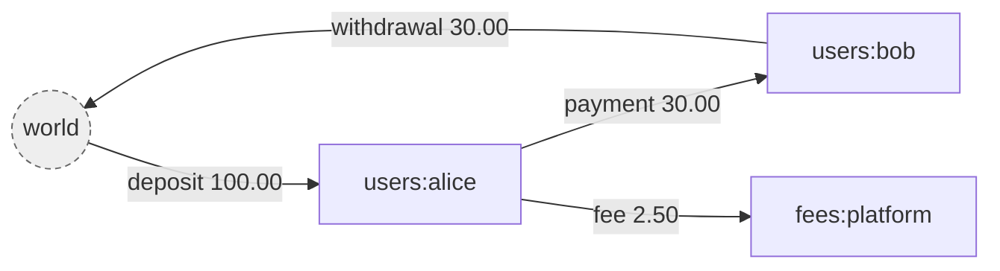
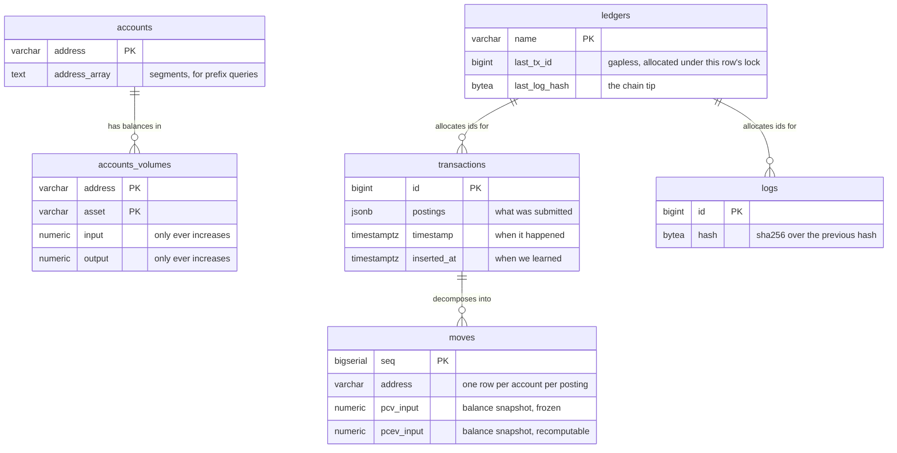
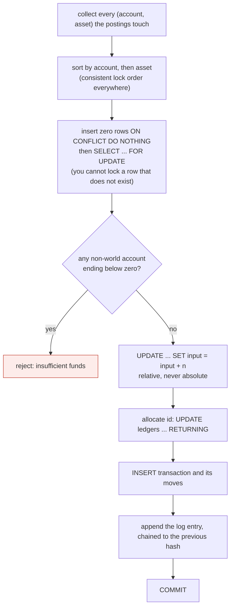

# giro

A double entry ledger. Go and PostgreSQL.

*giro*: a transfer between accounts, from the Greek for circle. Money moves
around the system and never leaves it, which is also the invariant the whole
design protects.

---

## What it is

A ledger records movements of value between accounts. Its only real job is to
never lose track of any of it.

The atomic unit is a **posting**: an amount of one asset moving from one account
to another.

```json
{ "source": "world", "destination": "users:alice", "asset": "USD/2", "amount": 10000 }
```

A **transaction** is an ordered list of postings applied atomically. All of them
commit or none do. That is the only write operation in the system.

Four ideas carry the rest.

**Money is conserved.** Value enters from a special account called `world` and
leaves to it. `world` is the only account allowed a negative balance. For any
asset, every balance summed together always equals exactly zero.



`world` is not a place money sits. It is the boundary of the ledger, standing
for everything not tracked here: a bank, a card network, someone's pocket. Its
balance is negative by exactly the total held inside, so reading it tells you
your outstanding liability.

**Volumes, not balances.** Each account holds two counters per asset, `input`
and `output`, and both only ever increase. Balance is `input - output`, computed
on read and stored nowhere. Keeping gross flow means an account that settled
millions and now holds nothing is distinguishable from one never used, and it
makes every update relative rather than absolute.

**The log is the source of truth.** Every change appends a SHA-256 chained entry
to `logs`. The `transactions` and `accounts_volumes` tables are a projection of
that log, kept because replaying from zero on every read would be absurd. If
they ever disagree with the log, the log is right.

**Nothing is mutated.** A mistake is corrected by appending a compensating
transaction, never by editing a row. Metadata is versioned. The history is the
product.

---

## Status

| Step | | |
|---|---|---|
| 1 | Domain types, validation, volume aggregation | done |
| 2 | Schema and migration runner | done |
| 3 | Commit path: sorted row locks, balance checks | done |
| 4 | Hash chain and idempotency | done |
| 5 | HTTP API | next |
| 6 | Revert and versioned metadata | |
| 7 | Effective dates and backdating | |
| 8 | Invariant tests | |

---

## Running it

Requires Go 1.26 and PostgreSQL 17.

```bash
createdb giro && createdb giro_test
cp .env.example .env          # then edit the connection strings
just migrate
just test
```

`just` on its own lists every recipe.

---

## The data model

Six tables. Every one carries `ledger` as the first element of its key, so the
tenant boundary is structural rather than something each query has to remember.



`accounts_volumes` is the only table that is ever updated. Everything else is
append only.

The same facts live at three grains, and each answers a different question.

| Table | Grain | Answers |
|---|---|---|
| `transactions` | per transaction | what was submitted, verbatim |
| `moves` | per account per posting | what did this account do, and when |
| `accounts_volumes` | per account per asset | what is the balance now |

---

## How a transaction commits

One PostgreSQL transaction, in exactly this order. Steps 2 and 3 are the whole
trick.



Two properties fall out of the ordering.

Sorting removes the precondition for deadlock. Two sessions can only deadlock
by taking the same locks in opposite orders, so a globally consistent order
makes that impossible rather than merely unlikely.

Relative updates make a lost update impossible. The database performs the
addition, so a value read at the start never becomes a value written at the
end.

---

## Decision log

Each entry states what was decided and why, and where useful, what would make
us revisit it. Append as we go rather than rewriting history.

### D1. Postings name both sides, and amounts are always positive

A posting carries source, destination, asset and a positive amount. There is no
debit or credit flag and no sign.

Naming both sides in one record makes an unbalanced entry impossible to write
down, rather than an error to be detected later. Direction is already carried by
which field an account sits in, so a sign would be a second way of saying the
same thing, and two ways of saying one thing is two ways for them to disagree.

### D2. Volumes rather than balances

Store `input` and `output`, both monotonically increasing. Derive balance.

Three reasons, in increasing weight. Gross flow is information a balance
destroys. Additive updates compose under concurrency while absolute writes lose
each other. And a frozen snapshot on each move turns historical balance into an
index seek instead of a replay.

### D3. The asset string carries its own scale

`USD/2` means two decimal places, so `100` is one dollar. There is no scale
column anywhere.

A scale stored beside an amount can be lost in a serialisation round trip or
defaulted to zero by a migration, and then `10000` silently becomes ten thousand
dollars instead of a hundred. Fusing scale to identity makes an amount
uninterpretable without it.

### D4. Arbitrary precision integers everywhere

`*big.Int` in Go, `numeric` with no precision in PostgreSQL.

`int64` overflows at 9.2e18, which two units of an 18 decimal token reach. A
fixed width is a ceiling, and the cost of a ceiling here is silently wrong
money. A size guard of about 100 digits lives in validation to reject absurd
input, which is a denial of service concern rather than a business rule.

### D5. `timestamptz` for every timestamp

PostgreSQL stores an instant in UTC and converts on the way out.
`timestamp without time zone` stores wall clock with no zone, which puts the
burden of normalising on every write path, and one missed conversion is silent.

### D6. Gapless ids from a counter column, not a sequence

Transaction and log ids come from `UPDATE ledgers SET last_tx_id = last_tx_id + 1
RETURNING`, inside the transaction.

A sequence takes no row lock and is faster, but it is non transactional: a
rolled back transaction burns an id and leaves a gap. The counter serialises
writes per ledger, which we already pay for, because synchronous hash chaining
has to read the previous hash before writing the next. The lock needed for the
chain is the same lock that allocates the id, so gaplessness is free.

**Revisit if** hashing moves to a background process, at which point the
serialisation is no longer paid for and a sequence becomes the better trade.

**Care needed when doing so.** Measured after step 3: this row lock serialises
far more than intended, since it is held to commit and everything after id
allocation therefore runs one transaction at a time per ledger. Removing the
row lock without also verifying the concurrency tests still fail when
`SELECT ... FOR UPDATE` is removed would drop a defence nothing is currently
watching.

### D7. No foreign key referencing `ledgers`

A foreign key check takes `FOR KEY SHARE` on the parent row. The commit path
takes `FOR UPDATE` on the same `ledgers` row to allocate an id. Two concurrent
transactions would each hold the shared lock and each wait to upgrade to the
exclusive one, which deadlocks. Sorting cannot help, because there is only one
lock and the problem is the change in strength rather than the order.

The `moves` to `transactions` foreign key is kept, because that parent row is
inserted by the same transaction and is invisible to anyone else, so there is
nothing to share and no upgrade.

### D8. `text[]` for exploded addresses, not `jsonb`

PostgreSQL arrays are ordered and indexable by position, which is exactly what
address matching needs: `address_array[1] = 'users'` for the first segment,
`array_length` for depth. Storing this as `jsonb` would mean encoding position
into the keys to get the same thing back.

### D9. Two address indexes, because there are two query shapes

A plain prefix such as `users:42:*` is a range scan on the address text using a
`varchar_pattern_ops` index. Measured on 150k accounts, that is an index only
scan costing 8 against 1297 for the GIN path.

A wildcard in the middle, `users:*:wallet`, cannot be expressed as a range, so
it uses GIN containment to narrow and a positional predicate to filter.
Containment alone is wrong because it is position independent: searching for
`users` also matches `fees:users:refunds`.

A positional predicate never drives an index. It is there for correctness, not
speed.

### D10. Forward only migrations, with checksums

No down migrations. You cannot un-drop a column that had data, so every real
rollback is a new migration anyway, and a down half is a file nobody tests that
lies under pressure.

Every applied migration records a SHA-256 of its body. Editing a migration that
already ran is a hard error, because otherwise development and production
diverge silently and only one of them is right.

### D11. Migrations hold a session advisory lock on a dedicated connection

Two instances booting at once must not both apply the same migration. A session
scoped advisory lock is released automatically when the connection drops, so a
crashed migration cannot strand it, which a lock row would.

It must be a dedicated `*pgx.Conn` and never a pool. Releasing on a different
pooled connection returns false and does nothing, leaving the lock held until
that connection happens to close. The signature takes `*pgx.Conn` so the type
system enforces this.

### D12. A nil amount panics instead of being read as zero

A nil counter in `Volumes` means nothing has flowed, so it is safely treated as
zero. A nil `Amount` on a posting means the request was malformed. Coercing it
would turn a broken payment into a no-op that commits and returns success.

Validation rejects nil, so the panic is unreachable through any correct path. It
exists to make a skipped validation loud rather than silent.


`jsonb` parses into a binary tree. It reorders keys, strips whitespace, and
silently keeps only the last of any duplicate key. The bytes that come back are
not the bytes that went in.

That is fatal for a hash chain. A hash taken at write time would never match one
recomputed during verification, so the integrity check would fail on a perfectly
healthy ledger, which is worse than not having one: a real problem becomes
indistinguishable from the false alarm.

`json` is validated on write and stored verbatim, and round trips byte for byte.
The indexing `jsonb` would buy is irrelevant here, because a log entry is
appended, read whole for replay, and looked up by `idempotency_key`, which is
its own column. Nothing ever queries inside one.

This applies only to `logs.data`. `transactions.postings` and the metadata
columns stay `jsonb`, since nothing hashes them and querying into them is
useful.

### D13. Multi ledger from the start, in one schema

Every table carries `ledger` first in its key. Retrofitting tenancy means
touching every table, index, query and test while carrying live data, whereas
adding the column now costs one column and gives the composite key that keyset
pagination wants anyway.

Since the hash chain serialises writes per ledger, separate ledgers are also how
write throughput scales.

### D14. The log entry is stored as `json`, not `jsonb`

`jsonb` parses into a binary tree. It reorders keys, strips whitespace, and
silently keeps only the last of any duplicate key. The bytes that come back are
not the bytes that went in.

That is fatal for a hash chain. A hash taken at write time would never match one
recomputed during verification, so the integrity check would fail on a perfectly
healthy ledger, which is worse than not having one: a real problem becomes
indistinguishable from the false alarm.

`json` is validated on write and stored verbatim, and round trips byte for byte.
The indexing `jsonb` would buy is irrelevant here, because a log entry is
appended, read whole for replay, and looked up by `idempotency_key`, which is
its own column. Nothing ever queries inside one.

This applies only to `logs.data`. `transactions.postings` and the metadata
columns stay `jsonb`, since nothing hashes them and querying into them is
useful.

---

## Layout

```
cmd/giro/            cli: migrate up, status, new
internal/ledger/     domain: postings, volumes, addresses, assets. no sql
internal/migrate/    migration runner and generator
migrations/          numbered sql, embedded into the binary
```

The domain package knows nothing about SQL, and storage will know nothing about
HTTP.
