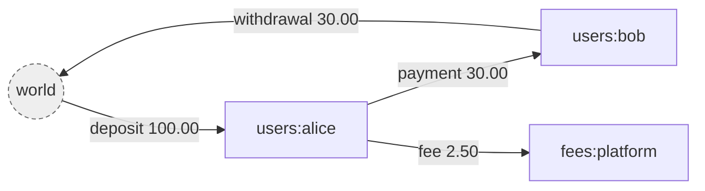
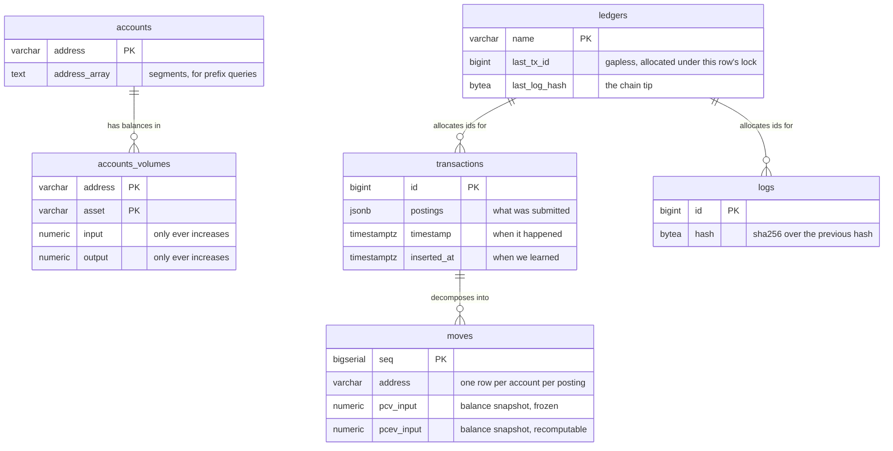
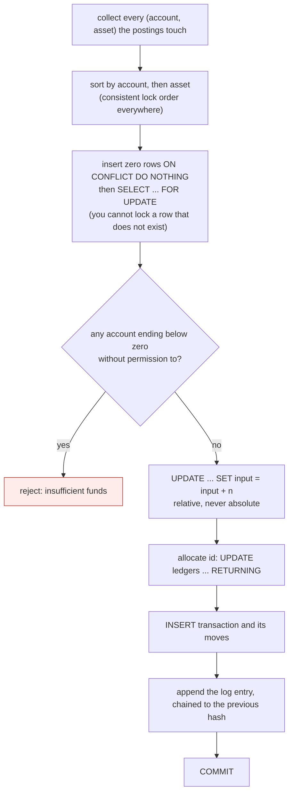

# giro

A double entry ledger. Go and PostgreSQL.

*giro*: a transfer between accounts, from the Greek for circle. Money moves
around the system and never leaves it, which is also the invariant the whole
design protects.

```go
tx, err := store.CommitTransaction(ctx, ledger.Postings{
    {Source: "world", Destination: "users:alice", Asset: "USD/2", Amount: big.NewInt(10000)},
}, storage.CommitOptions{Reference: "deposit-1"})
```

- **Money cannot be created or destroyed**, and the database enforces it, not
  just the application.
- **History cannot be rewritten.** Append only, hash chained, and it holds
  against raw SQL.
- **Arbitrary precision.** `*big.Int` and `numeric`, so an 18 decimal token is
  not a rounding problem.
- **Two clocks.** What was true on the 3rd stays answerable after a settlement
  file arrives on the 7th.
- **Nine checks** you can schedule, each of which reports what it examined.
  Seven run unconditionally; two more need the window you consider stale.

One direct dependency: the Postgres driver. Telemetry lives in
[a separate module](obs/) so that stays true.

---

## Quickstart

Five minutes to a working ledger. Requires Go 1.26 and PostgreSQL 17.

### 1. Create the database and run the migrations

```bash
createdb giro && createdb giro_test
cp .env.example .env          # then edit the connection strings

just db-app-role              # create the role the service connects as
just migrate                  # apply the schema, as the owner
```

`.env` names two roles because a deployment has two. `DATABASE_URL` is what
everything reads and points at `giro_service`, which can move money and cannot
alter a table. `GIRO_OWNER_DATABASE_URL` is read by the justfile only, so
`just migrate` runs as the role that owns the tables — the binary still reads a
single variable, and the recipe sets it for the length of one command exactly
as a deployment's migration step does.

`DATABASE_URL` is what everything reads. Migrations need the role that owns the
tables; serving must not have it, because a table's owner can switch off the
triggers that guard it — so the migration step runs with that role in its own
environment. See [The three roles](#the-three-roles).

### 2. Start it

```bash
just serve
```

Open <http://localhost:8080>. That page explains the model and drives the
running service: create a ledger, commit transactions, watch the balances and
the hash chain, and see a real rejection.

`giro serve` refuses to start against a schema it does not match, and warns if
it is connected as something that can disable its own guards.

### 3. Make a ledger and put money in it

Every ledger declares the assets it handles. `USD/2` carries its own scale, so
`10000` is $100.00.

```bash
L=http://localhost:8080/v1/ledgers/demo

curl -X POST $L
curl -X POST $L/assets -H 'Content-Type: application/json' -d '{"asset":"USD/2"}'

curl -X POST $L/transactions -H 'Content-Type: application/json' -d '{
  "postings": [
    {"source": "world", "destination": "users:alice", "asset": "USD/2", "amount": 10000}
  ]
}'
```

`world` is where value enters from. It is the only account allowed a negative
balance by default, and its balance is your total outstanding liability.

### 4. Read it back

```bash
curl $L/accounts/users:alice/balances   # {"USD/2":10000}
curl $L/balances                        # {"USD/2":0}  <- conservation
curl $L/logs                            # the hash chained audit trail
```

That second one is the point. Summed across every account, every asset is
exactly zero — always, by construction.

### 5. Try to break it

```bash
curl -X POST $L/transactions -H 'Content-Type: application/json' -d '{
  "postings": [
    {"source": "users:alice", "destination": "users:bob", "asset": "USD/2", "amount": 999999}
  ]
}'
# 422  {"code":"INSUFFICIENT_FUNDS",
#        "details":{"account":"users:alice","asset":"USD/2","available":"10000","requested":"999999"},
#        "message":"insufficient funds: users:alice holds 10000 USD/2, needs 999999"}
```

### 6. Check the book

```bash
just verify
```

Seven checks, each reporting what it examined. Two more run when you say what
counts as stale — `giro verify --stale-after=4h --recon-after=4h` — because
neither has a default anyone else can choose for you.

`giro verify --last --max-age=25h` is the other half: it fails if a check has
*stopped* running.

`just` on its own lists every recipe. `just check` runs `fmt`, `vet`, `lint`,
`test` and `test-restricted` — everything CI runs, including the whole suite as
the restricted database role.

### The commands

```
giro serve [addr]              run the http api, default :8080
giro migrate up                apply every pending migration
giro migrate status            what has run and what has not
giro migrate new <name>        create an empty migration
giro verify [ledger...]        run every check, record that they ran
giro verify --last             when each check last ran
giro account show <l> <addr>   how an account is bounded, per asset
giro account allow-negative    permit a negative balance, one asset at a time
giro account close  <l> <addr> take an account out of service
giro recover tip [ledger...]   each ledger's position: ledger:logID:hash
giro recover check <tip>       did a restore come back where you think
giro recover resume <tip>      resume above every id ever issued
```

Flags come before the ledger names, and `giro verify` refuses one written
after — a flag parsed as a ledger name would check a ledger that does not
exist, find nothing wrong with it, and exit zero.

`giro account` is the only way to set account policy, and that is deliberate:
see [What has no HTTP API](#what-has-no-http-api).

Every command reads `DATABASE_URL`. `giro migrate` is the one that needs the
role owning the tables, so it is run as its own step with that role in the
environment — see [The three roles](#the-three-roles).

---

## Using it as a library

giro is importable, not only a server. `internal/api` is the server and stays
private; everything else is public.

```go
import (
    "github.com/pixperk/giro/ledger"   // postings, volumes, addresses, assets
    "github.com/pixperk/giro/storage"  // the engine
    "github.com/pixperk/giro/migrate"  // the migration runner
    "github.com/pixperk/giro/fx"       // conversion at a stated rate
    "github.com/pixperk/giro/recon"    // matching statement lines
)

store := storage.New(pool, "main")
```

`ledger` and `storage` know nothing about currencies, trades, wires or rails.
`fx` and `recon` are layers above that do, and the compiler enforces that
direction: the engine cannot import them.

| Package | For |
|---|---|
| [`recon`](recon/README.md) | Reconciling against banks, exchanges and chains — [API](recon/API.md) |
| `fx` | Deriving a conversion's amounts from its rate |
| `migrate` | Applying and checking migrations |
| [`obs`](obs/) | OpenTelemetry. A separate module, so the engine keeps one dependency |

---
## What it is

A ledger records movements of value between accounts. Its only real job is to
never lose track of any of it.

The atomic unit is a **posting**: an amount of one asset moving from one account
to another.

```json
{ "source": "world", "destination": "users:alice", "asset": "USD/2", "amount": 10000 }
```

A **transaction** is an ordered list of postings applied atomically. All of them
commit or none do. That is the only write operation in the system.

Four ideas carry the rest.

**Money is conserved.** Value enters from a special account called `world` and
leaves to it. `world` is allowed a negative balance, and by default it is the
only one. For any asset, every balance summed together always equals exactly
zero.



`world` is not a place money sits. It is the boundary of the ledger, standing
for everything not tracked here: a bank, a card network, someone's pocket. Its
balance is negative by exactly the total held inside, so reading it tells you
your outstanding liability.

**Volumes, not balances.** Each account holds two counters per asset, `input`
and `output`, and both only ever increase. Balance is `input - output`, computed
on read and stored nowhere. Keeping gross flow means an account that settled
millions and now holds nothing is distinguishable from one never used, and it
makes every update relative rather than absolute.

**The log is the source of truth.** Every change appends a SHA-256 chained entry
to `logs`. The `transactions` and `accounts_volumes` tables are a projection of
that log, kept because replaying from zero on every read would be absurd. If
they ever disagree with the log, the log is right.

**Nothing is mutated.** A mistake is corrected by appending a compensating
transaction, never by editing a row. Metadata is versioned. The history is the
product.

---
---

### The api

```
POST   /v1/ledgers/{ledger}                          create a ledger
GET    /v1/ledgers/{ledger}
POST   /v1/ledgers/{ledger}/assets                   register an asset, required before use
GET    /v1/ledgers/{ledger}/assets
POST   /v1/ledgers/{ledger}/transactions             commit, Idempotency-Key header, ?dryRun=true
POST   /v1/ledgers/{ledger}/transactions/bulk        commit several as one event
GET    /v1/ledgers/{ledger}/transactions             list, cursor paginated
GET    /v1/ledgers/{ledger}/transactions/{id}
POST   /v1/ledgers/{ledger}/transactions/{id}/revert
POST   /v1/ledgers/{ledger}/transactions/{id}/metadata
DELETE /v1/ledgers/{ledger}/transactions/{id}/metadata/{key}
GET    /v1/ledgers/{ledger}/accounts/{address}       ?expand=volumes,effectiveVolumes&at=
GET    /v1/ledgers/{ledger}/accounts/{address}/balances   ?at=
GET    /v1/ledgers/{ledger}/accounts/{address}/moves      statement, ?asset= &from= &to=
POST   /v1/ledgers/{ledger}/accounts/{address}/metadata
DELETE /v1/ledgers/{ledger}/accounts/{address}/metadata/{key}
GET    /v1/ledgers/{ledger}/balances                 ?prefix=users:
GET    /v1/ledgers/{ledger}/logs                     the audit trail
```

### Every write needs an Idempotency-Key

`POST /transactions` and `POST /transactions/bulk` **require** an
`Idempotency-Key` header. Without one they return `400
IDEMPOTENCY_KEY_REQUIRED`.

This is not a convenience, and it is required rather than recommended for the
same reason everything else here is a default rather than a note. A connection
lost after the server has committed but before you receive the response leaves
you unable to tell whether the transaction landed. That window cannot be
closed — it is a property of networks, not a bug — so the only remedy is a key
you can retry under, and giro's [fault-injection tests](storage/chaos_test.go)
exist to prove the remedy works: a connection severed at a random point, a
retry under the same key, and exactly one transaction every time.

A ledger that accepts an unkeyed write is a ledger that will eventually pay
somebody twice, on the day their network misbehaves, and nobody will find out
until reconciliation.

```bash
curl -X POST $L/transactions   -H 'Content-Type: application/json'   -H 'Idempotency-Key: inv-2291'   -d '{"postings": [...]}'
```

Use the identifier the payment already has — an invoice number, a wire
reference, your own request id. Replaying the key returns the original
transaction; replaying it with *different* postings is an error, because that
is a bug rather than a retry.

`?dryRun=true` needs no key: it commits nothing, so there is nothing to
duplicate. And `giro serve --allow-unkeyed-writes` turns the requirement off,
for a caller that deduplicates upstream — which is then a decision somebody
made out loud rather than one they arrived at by not setting a header.

### There is no authentication

**`giro serve` authenticates nothing.** Every route above is open to anyone who
can reach the port, and the routes above move money.

That is a deliberate scope decision rather than an omission, and it has the
same shape as the rest of [what has no HTTP API](#what-has-no-http-api): giro
does not know who your users are, what a session means in your product, or
which of them may touch which ledger. Guessing would produce an authorisation
model you would have to work around.

So it is your gateway's job. Run it on a private network, behind whatever
already terminates auth for your other services, and never expose the port.
Treat reaching giro as equivalent to holding a database credential, because it
is.

If you would rather not have that boundary to defend at all, **embed it as a
library** — then there is no port, and the only thing that can commit a
transaction is your own code.

Outside the versioned API:

```
GET    /                 the page that explains the model and drives the service
GET    /docs             the contract, rendered and callable
GET    /openapi.yaml     the contract itself
GET    /healthz          liveness
```

`GET /v1/ledgers/{ledger}/balances` with no prefix covers the whole ledger,
`world` included, so it is always exactly zero for every asset. That is the
conservation invariant, readable over http.

`?at=` asks what was true on an effective date rather than what is true now.
The two differ whenever a transaction has been backdated, which for anything
taking settlement files from the outside world is most of the time.

---

### What has no HTTP API

A good deal of what giro does is reachable only from Go or from the CLI. None
of it is an oversight, and the reasons differ.

| Capability | Where | Why not over HTTP |
|---|---|---|
| Account bounds, closure | `giro account`, library | These are the switches that turn the guards off. An endpoint letting a caller mark its own account unbounded is not an API, it is a hole in one — the overdraw guard stands between a bug and minted money, and permission to disable it should not travel over the same wire as the requests it protects against. |
| The checks | `giro verify`, library | Each is a full pass over a table: behind an endpoint they are a denial of service anyone can trigger, and they answer a question nobody asks mid-request. They belong on a schedule that records that it ran. |
| [`recon`](recon/) | library | Reconciliation needs a `Source`, and you cannot pass an implementation of an interface over HTTP. The adapter has to live in a process that can run your code. |
| [`fx`](fx/) | library | Not an operation. It builds the postings a conversion needs from the rate you state, and you commit them through the ordinary transactions endpoint. |
| `migrate` | `giro migrate`, library | Schema changes take a session lock and must connect directly to Postgres rather than through a pooler. A serving process should not be able to change the schema, or to claim it changed one. |

The line is the same in every row: **the API is for moving money, and
everything else is not.** Setup, policy and inspection are operator work, done
by something with a shell or a deployment, not by whatever is holding an HTTP
connection.

The privilege is not what separates them — `giro_app` is granted `update` on
the policy columns and always was, because the commit path needs the row. The
channel is. So if you run giro as a service you still need a path to run
`giro account` and `giro verify`: a job, a task runner, a deployment step.
Serving it and operating it are two jobs.

---
---

## The data model

Eleven tables, of which these six carry the ledger itself. Every one carries
`ledger` as the first element of its key, so the tenant boundary is structural
rather than something each query has to remember.



Only `logs` is append only without qualification. `accounts_volumes` is updated
by every commit, and three others change in narrow, named ways: a transaction
is stamped when reverted and carries metadata, a move has its effective volumes
rewritten when something lands behind it, and an account's metadata and first
usage move. Nothing that was *recorded* ever changes, and the database enforces
exactly that column by column (D35).

The same facts live at three grains, and each answers a different question.

| Table | Grain | Answers |
|---|---|---|
| `transactions` | per transaction | what was submitted, verbatim |
| `moves` | per account per posting | what did this account do, and when |
| `accounts_volumes` | per account per asset | what is the balance now |

The other five are not the ledger; they are what surrounds it.

| Table | Holds |
|---|---|
| `assets` | Which assets this ledger handles, one scale per currency. A foreign key from `accounts_volumes`, which is what stops a mistyped `USDD/2` becoming a second currency holding real money (D18). |
| `verification_runs` | That a check ran, when, and what it found — so a scheduler that stopped can be told apart from a book with nothing wrong. |
| `recon_sources`, `recon_records`, `recon_matches` | What the outside world said, and which movement each line was paired with. Written by [`recon`](recon/), never by the commit path. |

---
---

## How a transaction commits

One PostgreSQL transaction, in exactly this order. Steps 2 and 3 are the whole
trick.



Two properties fall out of the ordering.

Sorting removes the precondition for deadlock. Two sessions can only deadlock
by taking the same locks in opposite orders, so a globally consistent order
makes that impossible rather than merely unlikely.

Relative updates make a lost update impossible. The database performs the
addition, so a value read at the start never becomes a value written at the
end.

---
---

## The checks

Nine, none on the write path. `giro verify` runs them all and exits non-zero on
a finding.

| Check | Catches | A finding means |
|---|---|---|
| `conservation` | Value created or destroyed | **A fault.** The master invariant. |
| `log` | An entry edited or removed | **A fault.** The chain is broken. |
| `projection` | The tables disagreeing with the log | **A fault.** The only check that sees a commit path writing one thing and logging another. |
| `effective_volumes` | The backdating cache disagreeing with a replay | A fault. |
| `balance_permissions` | A balance outside a bound it may not cross | A fault, or a deliberate revocation. |
| `closed_accounts` | A closed account holding money | Somebody must reopen it and deal with it. |
| `stale_balances` | Money that has stopped moving | A question. Opt in with `--stale-after`. |
| `conversions` | Amounts disagreeing with the rate recorded beside them | A fault. From `fx`. |
| `reconciliation` | Statement lines still unmatched | The daily work queue. Opt in with `--recon-after`. From `recon`. |

The last two are contributed by layers above the engine rather than built into
it: the ledger has no idea two postings are a trade, or that a statement line
describes one of its movements.

`projection` is the one to run if you can only run one. It replays the log and
requires the tables to be exactly what the replay produces, which is what makes
"the log is the source of truth" a fact rather than an intention — and every
other check reads the projection, so a consistent lie passes them all.

---

## Observability

Nothing is emitted until you ask for it. The engine declares an interface and
computes nothing when it is unset; the OpenTelemetry adapter is
[a separate module](obs/), so `go get github.com/pixperk/giro` still brings one
direct dependency.

```bash
go get github.com/pixperk/giro/obs
```

```go
observer, shutdown, err := obs.Setup(ctx, "giro", obs.Options{
    SlowLock: 50 * time.Millisecond,
})
if err != nil {
    return err     // telemetry that silently did not start is worse than none
}
defer shutdown(ctx)

store := storage.New(pool, "main").Observe(observer)
```

That is the whole integration. Where the data goes is decided by the standard
`OTEL_*` environment variables — `OTEL_EXPORTER_OTLP_ENDPOINT` and friends — so
giro has no telemetry configuration of its own to learn, and `none` is a real
setting.

**A collector is optional, and giro does not ship one.** The SDK speaks OTLP
straight to any backend that accepts it; a collector earns its place in
production by absorbing batching and retries and being the one place redaction
is configured. But it is the upstream binary — mature, security sensitive, and
already modular through its own builder — and writing another would be the same
mistake as shipping an exchange client inside [`recon`](recon/).
[`deploy/otel-collector.yaml`](deploy/otel-collector.yaml) is a starting config.

### Three things worth knowing before you build a dashboard

**A refusal is not an error.** `users:alice cannot spend money she does not
have` is the ledger working. It gets its own counter and a span event, never an
error status. Generic HTTP middleware folds a `422` into a 4xx error rate, and
a correct ledger under ordinary load then looks like a system in trouble — with
the further cost that a real failure is buried in the noise. Group
`giro.refusals` by `giro.reason`: `insufficient_funds` is a product event,
`unknown_asset` is a bug in a caller and should sit flat at zero.

**No metric is labelled by account address.** Addresses are unbounded, so one
would mean a time series per customer. Ledger, asset and reason are labels;
addresses go on spans, where one exists per request rather than per series. A
test enforces it, and another asserts cardinality is a function of your
configuration rather than of your traffic.

**Spans nest, and that is the point.**

```
giro.commit                 what the caller waited for, retries included
└── giro.commit.attempt     one pass through the database transaction
    └── giro.lock           the row locking statement
```

It turns *"the commit took 45ms"* into *"40ms of it was waiting on `world`"*,
which is a different sentence with a different remedy. Every deposit takes a
row lock on `world`, making it the hottest row in the system by construction.
Nothing outside the engine can measure that: from the caller's side a contended
commit and a slow one are identical.

**When it climbs, split the boundary rather than tuning anything.** Give each
counterparty its own account — `external:bank:northwind:USD` instead of one
`world` — which [reconciliation](recon/) wants anyway. Measured against a
database 44ms away, four writers: one shared source ran at 2.96 tx/s, eight
counterparty accounts at 5.20, and fully disjoint accounts — the ceiling — at
5.32. A naming convention recovers 98% of what is available, and the tail is
where it shows: p99 372ms to 53ms. See [D58](DECISIONS.md) for why giro does
not shard a hot account's storage instead.

[obs/](obs/) has the metric catalogue with its cardinality, the refusal
taxonomy with who owns each reason, and what to alert on.

---

## The three roles

Every invariant in giro is a Postgres trigger or constraint, and **a table's
owner may switch its own triggers off.** So the role the service connects as
decides whether the guards are enforcement or documentation. Three roles, each
with one job:

| Role | Logs in | Owns the tables | For |
|---|---|---|---|
| the owner *(you, or a deploy user)* | yes | **yes** | `giro migrate`. Nothing else. |
| `giro_app` | **no** | no | Holds the privileges. `select`, `insert`, and `update` on named columns — no `delete`, no `truncate`, no `alter`. |
| `giro_service` | yes | no | What the service connects as. Owns nothing itself and inherits only what `giro_app` has. |

`giro_app` cannot log in, so nothing connects as it; it exists to be the single
place the grants are written. `giro_service` is a member of it and is what a
connection string points at. Splitting them means adding a privilege is one
`grant` rather than an audit of every credential in your deployment.

```bash
just db-app-role     # creates both, idempotent
```

### One variable, two environments

Every command reads `DATABASE_URL`, and nothing else. The separation between
migrating and serving lives in the **environment**, not in the variable name:

```bash
# the service, and the scheduled jobs
DATABASE_URL=postgres://giro_service@localhost:5432/giro

# the migration step — its own job, its own environment
DATABASE_URL=postgres://giro_owner@localhost:5432/giro  giro migrate up
```

A second variable name would not stop a deployment putting the owner in both,
and it costs every operator one more thing to get right. What actually catches
the mistake is `giro serve` checking at boot whether the connection it was
handed can disable its own guards, and saying so if it can.

### Checking it rather than believing it

```
$ just privileges
 current_user | superuser | owns_tables | can_append | can_erase | can_rewrite
--------------+-----------+-------------+------------+-----------+-------------
 giro_service | f         | f           | t          | f         | f
```

`owns_tables f` is the one that matters: it is the difference between a guard
and a comment. `can_erase` and `can_rewrite` false are why the log is append
only against raw SQL and not merely against the application.

The test suite runs twice, once as the owner and once with `GIRO_TEST_ROLE=giro_app`
(`just check` does both). The tests that skip under the second run are exactly
the ones that must damage the book to prove a guard catches it — they cannot
run as a role unable to do the damage.

`giro account` and `giro verify` both work as `giro_service`; neither needs the
owner. If a command of yours does, that is worth knowing before it is in a
deployment.

---

## Operating it

| | |
|---|---|
| [deploy/](deploy/) | Scheduling the checks: cron, systemd, Kubernetes, and what to page on |
| [obs/](obs/) | OpenTelemetry, as a separate module. What to alert on, and why a refusal is not an error. |
| [deploy/otel-collector.yaml](deploy/otel-collector.yaml) | A starting collector config, including the redaction question |
| `giro verify` | Seven checks, nine with `--stale-after` and `--recon-after`. Exits non-zero on a finding. |
| `giro verify --last --max-age=25h` | Fails if a check has stopped running |
| `giro account` | Account bounds and closure. No endpoint, by design. |
| [deploy/RECOVERY.md](deploy/RECOVERY.md) | **Read before you need it.** A ledger cannot be re-derived, and a restore silently reuses ids. |
| `giro recover tip` | Record hourly. It is what proves a restore landed where you think. |
| `just privileges` | What the serving connection can actually do |
| `just db-sweep` | Drop test schemas an interrupted run left behind |
| `just replay SEED` | Reproduce a property test failure from its printed seed |
| `just load [30s]` | Sustained load with latency percentiles, and the invariants checked after |
| `just bench` | What one commit costs with nothing else happening |

**Put the database in the same availability zone.** A commit is nine round
trips, so throughput is roughly one over the time the ledger row lock is held,
and that time is dominated by network distance rather than by work. Measured
against a hosted Postgres 279ms away: 3.7s per commit, 0.27 tx/s, and
throughput *falls* as callers are added — there is no parallelism to win and
the queueing is pure cost. This is worth more than any tuning.

**Know your tail, not your throughput.** `just load` runs sustained scenarios
and reports p50/p95/p99 alongside the rate. Throughput on one ledger is flat
from 1 caller to 32 — that is the serialisation working — so rising concurrency
lengthens the queue rather than the rate, and the p99 is what standing in it
costs. On a hot account at sixteen callers that is around 600ms with a tail
beyond a second, which your timeouts have to accommodate.

Every scenario ends by verifying conservation, the hash chain and the
projection: throughput that arrives with a broken invariant is not throughput.
Retries must be zero — deadlocks are supposed to be impossible, so anything
else means the lock ordering broke, and the harness fails on it.

**Record the position hourly.** `giro verify && giro recover tip` prints
`main:4291:3f4W…`. Ship it wherever your logs go. A restore takes every table
back together — the ledgers row, the log, `verification_runs` — so nothing
inside the database can tell you it happened. That line is the only thing the
restore cannot reach. See [RECOVERY.md](deploy/RECOVERY.md).

**Alert on two conditions, not one.** Findings above zero, *and* the absence of
a recent run. A detector that stopped running looks exactly like a book with
nothing wrong.

---

## Layout

```
api/openapi.yaml     the contract. written first, types generated from it
cmd/giro/            cli: serve, migrate
ledger/              domain: postings, volumes, addresses, assets. no sql
storage/             the commit path, the log chain, queries. no http
migrate/             migration runner and generator
internal/api/        handlers, error mapping, the docs page
migrations/          numbered sql, embedded into the binary
```

`ledger`, `storage` and `migrate` are importable. `internal/api` is not: it is
the server, not the library, and its shape is the contract in
`api/openapi.yaml` rather than a Go surface anyone should depend on.

Inside `storage`, one file per concern rather than one large one:

```
store.go       the type, scoped to a ledger
commit.go      the retry loop and the sequence inside one database transaction
allocate.go    id allocation and log appending, under one row lock
rows.go        the individual inserts a commit performs
moves.go       moves, and maintaining the two volume histories
retry.go       which errors are worth retrying, and for how long
volumes.go     locking and applying volume deltas
policy.go      which accounts may end below zero
revert.go      compensating transactions
metadata.go    merge and delete, with the no-op guard
read.go        queries and keyset pagination
effective.go   reads by effective date
verify.go      the invariant checks
```

Each layer knows nothing about the one above it. The domain has no sql, storage
has no http, and the generated types in `internal/api/gen.go` come from the
contract rather than from the domain, so the wire format can change without
disturbing the engine.

---

## Why it is like this

[DECISIONS.md](DECISIONS.md) records every non-obvious choice, the reasoning,
and what was turned down. Read it before changing something that looks wrong:
most of the constraints are load-bearing, and several were arrived at by being
wrong first.
