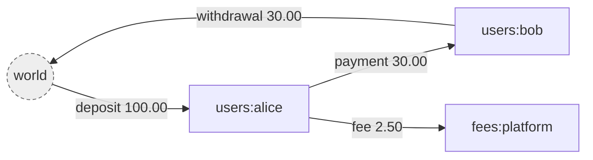
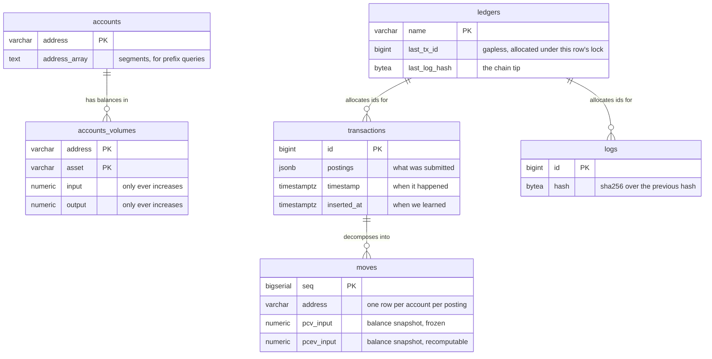
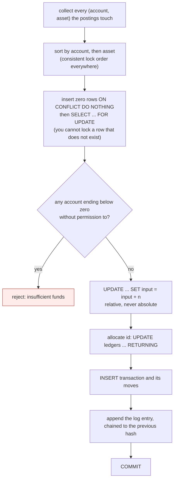

# giro

A double entry ledger. Go and PostgreSQL.

*giro*: a transfer between accounts, from the Greek for circle. Money moves
around the system and never leaves it, which is also the invariant the whole
design protects.

---

## What it is

A ledger records movements of value between accounts. Its only real job is to
never lose track of any of it.

The atomic unit is a **posting**: an amount of one asset moving from one account
to another.

```json
{ "source": "world", "destination": "users:alice", "asset": "USD/2", "amount": 10000 }
```

A **transaction** is an ordered list of postings applied atomically. All of them
commit or none do. That is the only write operation in the system.

Four ideas carry the rest.

**Money is conserved.** Value enters from a special account called `world` and
leaves to it. `world` is allowed a negative balance, and by default it is the
only one. For any asset, every balance summed together always equals exactly
zero.



`world` is not a place money sits. It is the boundary of the ledger, standing
for everything not tracked here: a bank, a card network, someone's pocket. Its
balance is negative by exactly the total held inside, so reading it tells you
your outstanding liability.

**Volumes, not balances.** Each account holds two counters per asset, `input`
and `output`, and both only ever increase. Balance is `input - output`, computed
on read and stored nowhere. Keeping gross flow means an account that settled
millions and now holds nothing is distinguishable from one never used, and it
makes every update relative rather than absolute.

**The log is the source of truth.** Every change appends a SHA-256 chained entry
to `logs`. The `transactions` and `accounts_volumes` tables are a projection of
that log, kept because replaying from zero on every read would be absurd. If
they ever disagree with the log, the log is right.

**Nothing is mutated.** A mistake is corrected by appending a compensating
transaction, never by editing a row. Metadata is versioned. The history is the
product.

---

## Running it

Requires Go 1.26 and PostgreSQL 17.

```bash
createdb giro && createdb giro_test
cp .env.example .env          # then edit the connection strings
just migrate
just db-app-role              # the role the service should connect as
just serve
```

`.env` carries two connection strings on purpose. Migrations need the role that
owns the tables; serving should not have it, because a table's owner can switch
off the triggers that guard it. `just db-app-role` creates a local role with no
privileges of its own that is a member of `giro_app`, and pointing
`DATABASE_URL` at it is what makes the guarantees in D35 and D36 real rather
than available.

`just privileges` prints what the serving connection can actually do, which is
the only version of that question that counts:

```
 current_user | superuser | owns_tables | can_append | can_erase | can_rewrite
--------------+-----------+-------------+------------+-----------+-------------
 giro_service | f         | f           | t          | f         | f
```

`giro serve` warns at boot if it is connected as something that can disable its
own guards. It warns rather than refuses: a local database and a first run
legitimately connect as the owner, and refusing would make the safe
configuration the awkward one to reach.

Then open <http://localhost:8080>, a page that explains the model and drives the
running service: create a ledger, commit transactions, watch the balances and
the hash chain, and see a real rejection. `?ledger=<name>` adopts an existing
one, so a populated demo can be linked to.

<http://localhost:8080/docs> renders the contract and can call it too.

`just` on its own lists every recipe. `just check` runs everything CI runs.

### Checking the book

```bash
giro verify                       # every check, every ledger, records the run
giro verify --stale-after=4h      # and money that has stopped moving
giro verify --last                # when each check last ran
```

Exits 1 on a finding, so a scheduler notices. Alert on two conditions rather
than one: findings above zero, and the absence of a recent run. A detector that
stopped running looks exactly like a book with nothing wrong, and every check
reports what it examined so that "looked and found nothing" is distinguishable
from "did not look".

### The api

```
POST   /v1/ledgers/{ledger}                          create a ledger
GET    /v1/ledgers/{ledger}
POST   /v1/ledgers/{ledger}/assets                   register an asset, required before use
GET    /v1/ledgers/{ledger}/assets
POST   /v1/ledgers/{ledger}/transactions             commit, Idempotency-Key header, ?dryRun=true
POST   /v1/ledgers/{ledger}/transactions/bulk        commit several as one event
GET    /v1/ledgers/{ledger}/transactions             list, cursor paginated
GET    /v1/ledgers/{ledger}/transactions/{id}
POST   /v1/ledgers/{ledger}/transactions/{id}/revert
POST   /v1/ledgers/{ledger}/transactions/{id}/metadata
DELETE /v1/ledgers/{ledger}/transactions/{id}/metadata/{key}
GET    /v1/ledgers/{ledger}/accounts/{address}       ?expand=volumes,effectiveVolumes&at=
GET    /v1/ledgers/{ledger}/accounts/{address}/balances   ?at=
GET    /v1/ledgers/{ledger}/accounts/{address}/moves      statement, ?asset= &from= &to=
POST   /v1/ledgers/{ledger}/accounts/{address}/metadata
DELETE /v1/ledgers/{ledger}/accounts/{address}/metadata/{key}
GET    /v1/ledgers/{ledger}/accounts/{address}/balances
GET    /v1/ledgers/{ledger}/balances                 ?prefix=users:
GET    /v1/ledgers/{ledger}/logs                     the audit trail
```

`GET /v1/ledgers/{ledger}/balances` with no prefix covers the whole ledger,
`world` included, so it is always exactly zero for every asset. That is the
conservation invariant, readable over http.

`?at=` asks what was true on an effective date rather than what is true now.
The two differ whenever a transaction has been backdated, which for anything
taking settlement files from the outside world is most of the time.

---

## The data model

Six tables. Every one carries `ledger` as the first element of its key, so the
tenant boundary is structural rather than something each query has to remember.



Only `logs` is append only without qualification. `accounts_volumes` is updated
by every commit, and three others change in narrow, named ways: a transaction
is stamped when reverted and carries metadata, a move has its effective volumes
rewritten when something lands behind it, and an account's metadata and first
usage move. Nothing that was *recorded* ever changes, and the database enforces
exactly that column by column (D35).

The same facts live at three grains, and each answers a different question.

| Table | Grain | Answers |
|---|---|---|
| `transactions` | per transaction | what was submitted, verbatim |
| `moves` | per account per posting | what did this account do, and when |
| `accounts_volumes` | per account per asset | what is the balance now |

---

## How a transaction commits

One PostgreSQL transaction, in exactly this order. Steps 2 and 3 are the whole
trick.



Two properties fall out of the ordering.

Sorting removes the precondition for deadlock. Two sessions can only deadlock
by taking the same locks in opposite orders, so a globally consistent order
makes that impossible rather than merely unlikely.

Relative updates make a lost update impossible. The database performs the
addition, so a value read at the start never becomes a value written at the
end.

---

## Decision log

Each entry states what was decided and why. If something here looks arbitrary,
the reasoning is the point of the entry.

### D1. Postings name both sides, and amounts are always positive

A posting carries source, destination, asset and a positive amount. There is no
debit or credit flag and no sign.

Naming both sides in one record makes an unbalanced entry impossible to write
down, rather than an error to be detected later. Direction is already carried by
which field an account sits in, so a sign would be a second way of saying the
same thing, and two ways of saying one thing is two ways for them to disagree.

### D2. Volumes rather than balances

Store `input` and `output`, both monotonically increasing. Derive balance.

Three reasons, in increasing weight. Gross flow is information a balance
destroys. Additive updates compose under concurrency while absolute writes lose
each other. And a frozen snapshot on each move turns historical balance into an
index seek instead of a replay.

### D3. The asset string carries its own scale

`USD/2` means two decimal places, so `100` is one dollar. There is no scale
column anywhere.

A scale stored beside an amount can be lost in a serialisation round trip or
defaulted to zero by a migration, and then `10000` silently becomes ten thousand
dollars instead of a hundred. Fusing scale to identity makes an amount
uninterpretable without it.

### D4. Arbitrary precision integers everywhere

`*big.Int` in Go, `numeric` with no precision in PostgreSQL.

`int64` overflows at 9.2e18, which two units of an 18 decimal token reach. A
fixed width is a ceiling, and the cost of a ceiling here is silently wrong
money. A size guard of about 100 digits lives in validation to reject absurd
input, which is a denial of service concern rather than a business rule.

### D5. `timestamptz` for every timestamp

PostgreSQL stores an instant in UTC and converts on the way out.
`timestamp without time zone` stores wall clock with no zone, which puts the
burden of normalising on every write path, and one missed conversion is silent.

### D6. Gapless ids from a counter column, not a sequence

Transaction and log ids come from `UPDATE ledgers SET last_tx_id = last_tx_id + 1
RETURNING`, inside the transaction.

A sequence takes no row lock and is faster, but it is non transactional: a
rolled back transaction burns an id and leaves a gap. The counter serialises
writes per ledger, which we already pay for, because synchronous hash chaining
has to read the previous hash before writing the next. The lock needed for the
chain is the same lock that allocates the id, so gaplessness is free.

The cost is real: this lock is held until commit, so writes to a single ledger
are serialised. Writes to different ledgers are not, which is also how write
throughput scales.

### D7. No foreign key referencing `ledgers`

A foreign key check takes `FOR KEY SHARE` on the parent row. The commit path
takes `FOR UPDATE` on the same `ledgers` row to allocate an id. Two concurrent
transactions would each hold the shared lock and each wait to upgrade to the
exclusive one, which deadlocks. Sorting cannot help, because there is only one
lock and the problem is the change in strength rather than the order.

The `moves` to `transactions` foreign key is kept, because that parent row is
inserted by the same transaction and is invisible to anyone else, so there is
nothing to share and no upgrade.

### D8. `text[]` for exploded addresses, not `jsonb`

PostgreSQL arrays are ordered and indexable by position, which is exactly what
address matching needs: `address_array[1] = 'users'` for the first segment,
`array_length` for depth. Storing this as `jsonb` would mean encoding position
into the keys to get the same thing back.

### D9. Two address indexes, because there are two query shapes

A plain prefix such as `users:42:*` is a range scan on the address text using a
`varchar_pattern_ops` index. Measured on 150k accounts, that is an index only
scan costing 8 against 1297 for the GIN path.

A wildcard in the middle, `users:*:wallet`, cannot be expressed as a range, so
it uses GIN containment to narrow and a positional predicate to filter.
Containment alone is wrong because it is position independent: searching for
`users` also matches `fees:users:refunds`.

A positional predicate never drives an index. It is there for correctness, not
speed.

### D10. Forward only migrations, with checksums

No down migrations. You cannot un-drop a column that had data, so every real
rollback is a new migration anyway, and a down half is a file nobody tests that
lies under pressure.

Every applied migration records a SHA-256 of its body. Editing a migration that
already ran is a hard error, because otherwise development and production
diverge silently and only one of them is right.

### D11. Migrations hold a session advisory lock on a dedicated connection

Two instances booting at once must not both apply the same migration. A session
scoped advisory lock is released automatically when the connection drops, so a
crashed migration cannot strand it, which a lock row would.

It must be a dedicated `*pgx.Conn` and never a pool. Releasing on a different
pooled connection returns false and does nothing, leaving the lock held until
that connection happens to close. The signature takes `*pgx.Conn` so the type
system enforces this.

The lock is acquired by polling `pg_try_advisory_lock` rather than by blocking
on `pg_advisory_lock`. A session parked in a lock wait still holds a virtual
transaction id, and `create index concurrently` waits for every virtual
transaction that was live when it started. A runner holding the lock and
building an index therefore waits for a runner waiting for the lock, and
Postgres breaks the cycle by killing the waiter. That is a boot failure in the
exact case the lock exists for. Polling has no such edge: between attempts the
waiting session holds nothing, at a cost of one poll interval of latency.

### D12. A nil amount panics instead of being read as zero

A nil counter in `Volumes` means nothing has flowed, so it is safely treated as
zero. A nil `Amount` on a posting means the request was malformed. Coercing it
would turn a broken payment into a no-op that commits and returns success.

Validation rejects nil, so the panic is unreachable through any correct path. It
exists to make a skipped validation loud rather than silent.


`jsonb` parses into a binary tree. It reorders keys, strips whitespace, and
silently keeps only the last of any duplicate key. The bytes that come back are
not the bytes that went in.

That is fatal for a hash chain. A hash taken at write time would never match one
recomputed during verification, so the integrity check would fail on a perfectly
healthy ledger, which is worse than not having one: a real problem becomes
indistinguishable from the false alarm.

`json` is validated on write and stored verbatim, and round trips byte for byte.
The indexing `jsonb` would buy is irrelevant here, because a log entry is
appended, read whole for replay, and looked up by `idempotency_key`, which is
its own column. Nothing ever queries inside one.

This applies only to `logs.data`. `transactions.postings` and the metadata
columns stay `jsonb`, since nothing hashes them and querying into them is
useful.

### D13. Multi ledger from the start, in one schema

Every table carries `ledger` first in its key. Retrofitting tenancy means
touching every table, index, query and test while carrying live data, whereas
adding the column now costs one column and gives the composite key that keyset
pagination wants anyway.

Since the hash chain serialises writes per ledger, separate ledgers are also how
write throughput scales.

### D14. The log entry is stored as `json`, not `jsonb`

`jsonb` parses into a binary tree. It reorders keys, strips whitespace, and
silently keeps only the last of any duplicate key. The bytes that come back are
not the bytes that went in.

That is fatal for a hash chain. A hash taken at write time would never match one
recomputed during verification, so the integrity check would fail on a perfectly
healthy ledger, which is worse than not having one: a real problem becomes
indistinguishable from the false alarm.

`json` is validated on write and stored verbatim, and round trips byte for byte.
The indexing `jsonb` would buy is irrelevant here, because a log entry is
appended, read whole for replay, and looked up by `idempotency_key`, which is
its own column. Nothing ever queries inside one.

This applies only to `logs.data`. `transactions.postings` and the metadata
columns stay `jsonb`, since nothing hashes them and querying into them is
useful.

---

### D15. The contract is written first, and only models are generated

`api/openapi.yaml` is the source of truth for the http surface, and the Go
types in `internal/api/gen.go` are generated from it. Changing the request shape
therefore shows up as a diff in the contract, deliberately made, rather than
falling out of somebody editing a struct.

Only models are generated. The same tool will also emit routing and query
parameter binding, but that pulls three modules into the build to parse query
strings, for a surface of eight endpoints on the standard library router. So
routing is hand written, and what the compiler no longer checks a test does:
every path in the contract must have a route, and every route must be in the
contract.

The generator itself is not a dependency. It runs from `just generate` with a
pinned version, so it never enters `go.mod`. The only thing this service links
against is a postgres driver.

### D16. Amounts are json numbers, and the Go type is a pointer

An amount goes over the wire as a json number rather than a string, matching how
it is stored: an arbitrary precision integer in the asset's smallest unit.

That has one consequence worth stating loudly, because it is a client side
hazard rather than a server one. Amounts can exceed 2^53, and JavaScript's
`JSON.parse` silently loses precision above that. A browser client must use a
big number aware parser. The contract says so in its description.

On the Go side the generated type is `*big.Int` and not `big.Int`, which is not
a stylistic preference. `big.Int` implements `MarshalJSON` on the pointer
receiver, and `encoding/json` can take the address of a struct field inside a
slice but not of a map value. With a value type, amounts inside slices marshal
correctly and every amount inside a map silently marshals as `{}`. Balances are
maps.

### D17. Errors carry a stable code, and 422 is not 400

Every error response has a `code` from a fixed set, alongside the http status.
The message is for humans and may change, the code is what a client branches on.

400 and 422 are different answers. A 400 means the request was malformed: a
negative amount, an address with a trailing space, a lowercase asset. A 422
means the request was well formed and could not be applied, which in practice
means insufficient funds. A client can fix the first by changing its code and
the second only by changing the world, so they should not share a status.

Insufficient funds carries the numbers in `details`, because an error a client
can act on programmatically should not require parsing a sentence.

Internal errors return a generic message. The real one goes to the log, since it
can carry table names, queries and account addresses.

### D18. Timestamps are truncated to microseconds

Postgres stores `timestamptz` at microsecond precision. A timestamp with
nanoseconds would be silently rounded on the way in, so the response to a create
would disagree with every later read of the same transaction.

Truncating at the boundary means the value returned is the value stored.

### D19. Malformed query strings are rejected rather than ignored

Go's `r.URL.Query()` discards any parameter it cannot parse, so a corrupted
query string arrives at a handler as absent parameters. For a cursor that is
dangerous: the client would silently receive the first page again and reprocess
transactions it has already seen.

Query strings are parsed explicitly, and anything unparseable is a 400.

### D20. Expansions are opt in, and an unknown one is an error

`GET /accounts/{address}` returns the account without its volumes, because most
reads of an account want its metadata rather than its money, and volumes cost a
second query. `?expand=volumes` asks for them.

An unrecognised expand value is a 400 rather than being ignored, so a typo does
not look like an account that happens to have no volumes.


### D21. Metadata history lives in the log, not in a revision table

Metadata is stored on the `transactions` and `accounts` rows as a jsonb column,
and every change appends a `SET_METADATA` or `DELETE_METADATA` entry to the log.

The obvious alternative is a table keyed by `(target, revision)` holding every
version of the document. That answers "what was the metadata at revision 3",
which nothing has asked for, and it would be a second append only history of
the same events with weaker guarantees than the one that is hash chained.

The split instead is: the column says what it is now, the log says how it got
that way, and a historical value is a replay of the log up to a date. If an
indexed historical lookup is ever needed, it can be built from the log, which
is what having a source of truth is for.

Postgres does the merge and the delete natively, `metadata || $new` and
`metadata - $key`, so there is no read modify write and two callers touching
different keys do not overwrite each other.

### D22. A metadata write that changes nothing writes nothing

Setting metadata that is already present is a no-op: no row is touched and no
log entry is appended.

Clients retry, so an identical write is normal traffic rather than a mistake.
Recording it would fill the hash chain with entries describing nothing
happening.

The cost is that the trail records changes rather than attempts, so "someone
tried to set this at 14:03" is not answerable when the value was already set.
For a ledger, what changed is the more useful record.

### D23. Tagging an account creates it

Accounts are never registered, so setting metadata on an address that has never
been used creates the row rather than returning a 404.

That is the moment a caller most wants it: attaching a user id to a wallet
before any money has moved through it. The account still holds nothing, since
tagging is not funding.


### D24. A revert is a new transaction, and it can fail

Reverting does not edit or delete anything. It commits a new transaction
holding the original's postings with both sides swapped, and stamps
`revertedAt` on the original as a mark that a correction exists.

Balances return to where they were. Volumes do not: both counters go up, so the
rows record that money moved and then came back, rather than looking like it
never moved.

The reversal goes through the same locking, balance check and log append as any
other transaction, which means it can be **rejected**. If the money has since
been spent it is not there to give back, and forcing it would manufacture a
negative balance. `force` exists for an operator who has decided that is the
lesser problem, and it is a deliberate act rather than a default.

Two guards worth knowing about. `revertedAt` is set inside the same database
transaction as the reversal, so two concurrent reverts cannot both pass the
check and refund twice. And the reversal reverses the *order* of the postings as
well as their direction, because keeping the order would pay the first account
back before the last had returned anything, and an intermediate account would
dip below zero.

### D25. A reversal is dated now, unless asked otherwise

By default the reversal carries the current time, not the original's effective
date. A reversal happens when it happens, and backdating one rewrites what
historical balances say about a period that has probably already been reported
on.

`atEffectiveDate` asks for the other behaviour, for the case where the reversal
is correcting a data entry error rather than undoing a real movement.


### D26. Effective volumes are maintained on write and verified by replay

Every move carries two snapshots. `pcv` follows insertion order and is written
once, recording what the ledger believed at the time. `pcev` follows effective
date order, which is a different sequence whenever a transaction is backdated,
and answers what was actually true on a date.

`pcev` is maintained on write: a new move reads the effective balance as of its
own timestamp, accumulates from there, and shifts every move already sitting
later in effective order by its delta. Historical balance is then an index seek
rather than a sum over an account's whole history.

The alternative is computing it on read, which is trivially correct and grows
with the account's age. Maintaining a cache is faster and can be wrong, so the
slow version exists too, as `VerifyEffectiveVolumes`: it walks every account in
effective order, accumulates, and compares against what is stored. Randomised
sequences of backdated transactions are checked against it.

That is the trade. The optimisation is only defensible because something
independent checks it, and an optimisation nothing checks is a guess.

The fix up is written in Go rather than as a database trigger, for the same
reason: logic in PL/pgSQL is hard to test and invisible to the type system.

### D27. The log is verified against the projection, not just for tamper evidence

`VerifyProjection` replays the log and requires that `accounts_volumes` is
exactly what it produces, that every transaction was logged, and that the log
describes no transaction the table lacks.

This is what makes "the log is the source of truth" a fact rather than a
statement of intent. It is also the only check that would catch a commit path
writing one thing and logging another: every other assertion reads the
projection, so a consistent lie passes all of them. Reversing the postings in
the logged copy leaves conservation, every balance and the hash chain intact,
and only this notices.

### D28. Dry run is the real path, rolled back

`?dryRun=true` takes the locks, checks the balances against live data, writes
the volumes and moves, and then rolls back instead of committing.

It is not a simulation, so it cannot drift from what a commit does. A
transaction that would be rejected is rejected here with the same status, which
is the entire point of previewing.

Nothing is consumed: no id is allocated, no idempotency key is claimed, no log
entry survives, and the account rows materialised to take locks disappear with
everything else. The id on the response is what it would have been, not a
reservation. It answers 200 rather than 201, because nothing was created.


### D29. Batches are atomic, and only atomic

`POST /transactions/bulk` applies every transaction or none of them. There is no
best effort mode and no per item result list.

A best effort batch is several requests with fewer round trips, which a caller
can do in a loop. All or nothing is the thing that cannot be built out of single
commits, so it is the one worth offering. Items are applied in order and see
each other's effects, so an item may spend what an earlier item provided.

Every lock the batch needs is taken up front, deduplicated and sorted, before
any item runs. Sorting within an item is not enough here: two batches touching
the same accounts in different item orders would each hold half of what the
other needs. Measured, a batch of fifty is roughly twice the throughput of fifty
single commits, because it pays for the ledger row lock once.

At most 100 items, because an unbounded batch holds locks on an unbounded number
of rows on tables other requests are queueing for.

### D30. Writes to one ledger are serialised, and that is measured

Every commit takes an exclusive lock on its ledger's row to allocate ids and
read the chain tip, and holds it until commit. So writes to a single ledger do
not benefit from more callers.

Measured on a laptop against local postgres:

| | |
|---|---|
| one caller, one ledger | about 1,200 transactions per second |
| sixteen callers, one ledger | about 1,200 per second, and zero retries |
| sixteen callers, eight ledgers | about 3,100 per second |
| batch of fifty against fifty singles | roughly twice the throughput |

The flat line from one caller to sixteen is the design working as described,
not a bottleneck to be tuned away. Throughput scales by adding ledgers, which
is one reason multiple ledgers exist. Zero retries under contention means the
lock ordering is holding: transactions queue rather than deadlock.

### D31. The write path reads a snapshot rather than summing history

Computing what an account held as of a date is the same question on the read
path and the write path: a read answers it for a caller, and a commit needs it
to place a new move in effective order.

The read path always read the latest snapshot. The write path summed the whole
history, which is O(n) in the account's age on every write. On 20,000 moves that
is a sequential scan taking 2 ms against an index seek taking 0.03 ms, roughly
sixty times slower and growing.

Both now read the snapshot. This was found by benchmarking, not by any
correctness test: the results were identical either way.

### D32. Addresses and assets are named types

`ledger.Address` and `ledger.Asset` rather than `string`. Both are strings
underneath, so nothing changes at runtime or in the database.

The value is in application code above this library, where an address is
carried through several layers before it reaches a posting. That is where a
transposed argument survives review, and where the compiler now refuses it.

It does not catch a transposed literal, because an untyped constant converts to
any string type. `SetAllowNegative(ctx, "USD/2", "cost:peg", true)` still
compiles and is refused at runtime by validation instead. And nothing catches a
transposed source and destination, since both are addresses. No type system
can.

The wire format is unaffected. The generated types in `internal/api/gen.go` use
`string`, because the contract describes JSON, and the domain types stop at
that boundary.

Done immediately after the packages became importable, while nothing outside
the module depended on them. It is a breaking change, and every day it waits
is another consumer to coordinate with.

### D33. The server refuses to start against a schema it does not match

`giro serve` checks the applied migrations against the ones it carries, before
it listens.

Without it a binary needing a migration nobody ran starts cleanly, answers its
health check, and fails on the first commit with a raw SQL error, in a money
path, in front of a caller. A deploy can act on a process that will not start.
It cannot act on one that started and lies.

Three outcomes rather than two, because only two are faults:

| State | Result |
|---|---|
| Schema behind the binary | Refuse. Something the code expects does not exist. |
| A migration applied with a different body | Refuse. The schema and the code disagree about what ran. |
| Schema ahead of the binary | Warn and serve. |

The third is the one worth explaining. The usual deploy order is migrate first,
then roll the binaries, so between those two steps every instance still on the
old build is running against migrations it does not carry. That is the deploy
working. Refusing there would mean an old instance could not be restarted
during a rollout, turning a routine deploy into an outage.

It is still reported, because the same state is a real fault if it outlives the
rollout, and nothing else would mention it.

The check takes no lock and applies nothing. A process that serves traffic
should not be able to change the schema.

### D34. Assets are declared, accounts are not

An account exists because a posting named it (D2). An asset has to be
registered first. Those look inconsistent and are not, and the difference is
the point.

An asset carries its own scale, so `USD/2` and `USD/6` are both well formed,
are different assets, and never mix. Without a registry a mistyped scale is not
an error, it is a second currency that accumulates its own balances, and
**conservation still passes** because each pile balances on its own. Nothing
anywhere would raise a word.

There are a handful of assets in a system and thousands of accounts, so
requiring the handful to be declared costs almost nothing and closes a failure
mode that is otherwise silent and permanent.

**One scale per currency, per ledger.** Registering `USD/2` makes `USD/6` and
bare `USD` refusable. It is expressed as a unique index on the code rather than
by storing a scale column, so the decision that no scale is stored anywhere
(D1) survives intact: the scale still lives in the asset identifier and the
engine still never branches on it. The index only says a ledger cannot hold two
spellings of one currency.

**Registration is permanent**, and the reason is worth stating. Re-registering
a currency at a different scale would reinterpret every amount already recorded
in it: 10000 of `USD/2` is a hundred dollars and the same number in `USD/6` is
a hundredth of one. That is not a correction, it is a silent restatement of the
whole book.

**Enforced by foreign key from `accounts_volumes` and `moves`,** so it holds
for raw SQL too. There is deliberately no foreign key to `ledgers` (D14),
because the commit path takes `FOR UPDATE` on that row and two transactions
each holding a shared lock and each waiting to upgrade is a deadlock sorting
cannot prevent. `assets` is safe from that because nothing ever updates a row
in it: no `FOR UPDATE` is taken, so there is no upgrade and no cycle.

The Go check exists for the error rather than the enforcement. A constraint
violation says `accounts_volumes_asset_registered`; a caller who mistyped a
scale needs to be told that `USD/2` exists and `USD/6` does not.

**Cost:** roughly 4% on the hot-account path, within noise elsewhere.

### D35. The invariants are enforced in the database, not only in Go

Every rule used to live in Go, which holds exactly as long as the application
is the only writer. It is not, and will not be: an engineer in psql, a backfill
script, a migration nobody thought through, credentials that got out. None of
those run the Go code.

| Guard | Shape | Catches |
|---|---|---|
| Append only on `logs` | row `before update or delete` | rewriting history |
| Named columns on `transactions`, `moves`, `accounts` | row, allow list | changing what was recorded |
| No truncate, every table | **statement** `before truncate` | erasing a table |
| Volumes only increase | row `before update` | faking a balance by lowering what was spent |
| No unpermitted overdraw | row `before insert or update` | spending what is not there |
| Conservation | **deferred constraint** | creating or destroying value |
| Counters never fall | row `before update` | reusing a transaction id |

Three of those are worth explaining.

**Conservation cannot be a row trigger.** `input = input + 500000` is an
increase, on one row, and nothing about that row is invalid. Conservation is a
property of the whole table. It also cannot be checked per statement, because a
commit writes one volume row at a time and passes through unbalanced
intermediate states. So it is a constraint trigger deferred to commit, which
asks the only question that matters: is the book balanced by the time this is
over.

**Truncate needs a different trigger shape.** It discards the table's files
rather than visiting rows, so no row trigger fires and update and delete guards
that look complete let the whole table go without raising anything. `before
truncate` exists only in the statement form, for the same reason.

**The lists say what is allowed, not what is forbidden.** A forbid list is only
as good as the imagination of whoever wrote it, and a column added by a future
migration arrives unprotected. Comparing whole rows with the permitted keys
removed means a new column is guarded from the moment it exists.

One carve out, found by the test suite rather than by reasoning. The overdraw
guard fires when the balance moves, not when the permission changes, so an
operator can stop further drawdown on an account that is already negative.

**There is no escape hatch, and there was.** An earlier version of this let a
revert declare itself forced through a transaction local setting, so that a
reversal could commit against an account that had since spent the money. Any
role can set a custom setting, so the application role could set it too, which
made the overdraw guard the only one of the seven the application could walk
past. `RevertOptions.Force` is gone with it.

An operator who needs a reversal that drives an account negative grants the
account the permission, reverts, and revokes. Three steps that leave a trail in
the permission state, and one of them is already the mechanism for exactly
this.

**The cost.** The conservation check is one aggregate over the accounts holding
that asset, per touched row, at commit. Measured: 0.045 ms at a thousand
accounts, 10.7 ms at two hundred thousand. Throughput fell about 8% across
ledgers and is unchanged sequentially. It grows with the book, and if that ever
matters the answer is a maintained total per asset rather than an aggregate.

**What this does not do on its own.** A table's owner outranks its own triggers
and can disable them with one statement. D36 is what closes that.

### D36. The application connects as a role that cannot disable the guards

`alter table logs disable trigger user` needs no privilege beyond owning the
table. So every guard in D34 was advisory while the application owned what it
was guarded by.

Two roles. The migration tool owns everything and runs only during a rollout.
`giro_app` gets `select`, `insert`, and `update` on named columns. No `delete`,
no `truncate`, no `alter`, no ownership, and no write access to
`schema_migrations`, so a serving process cannot claim it migrated something.

The column scoping is the load bearing half. A table level `update` grant would
re-open the money columns and leave the trigger as the only thing standing,
which is exactly the hole an external audit found in the system this borrows
from: the guard covered insert and delete, left update open, and ordinary table
privileges were enough to write a spendable balance.

The grants are the same allow list as the triggers, expressed in a second
mechanism. The trigger says what a row may become; the grant says what the role
may reach for. Neither is redundant, because they fail differently: a trigger
can be switched off by the table's owner, and a missing grant cannot be given
by the role that lacks it.

**It is tested rather than asserted.** `just test-restricted` runs the whole
suite as `giro_app`. Every application path passes, including reverts,
backdating, metadata and all four verifiers. Six tests skip, and they are
exactly the six that have to damage the book to prove the damage is noticed.
Under this role they cannot stage their attack.

Two things worth knowing. The role is `nologin`: nothing authenticates as it
directly, so the credential story stays out of the schema. And a missing grant
surfaces as `relation does not exist` rather than a permission error when the
schema `usage` grant is the one missing, which reads like a missing table and
is not.

### D37. Money in flight lives in a holding account, not in a status column

A wire is submitted at two and confirmed at six. Posting it at submission means
the books are wrong for four hours if it bounces; posting it at settlement
means the payer's balance shows money that has already gone, and they can spend
it twice. Both are the same mistake: one event recording two.

So it moves into a holding account and out again.

```
submitted   client:acme                 -> pending:wire:WR-2026-0142
settled     pending:wire:WR-2026-0142   -> external:bank:infinitus:USD
returned    pending:wire:WR-2026-0142   -> client:acme
```

This needs nothing from the engine. It is a naming convention, and three
properties fall out of what is already here:

- **The payer cannot spend it.** It genuinely left their account, so the
  balance guard is what stops them. No new mechanism.
- **Total value in transit is one prefix read.** A status would be something to
  filter; a balance is something to read.
- **It cannot be settled twice.** The holding account holds the amount exactly
  once, so a second settlement overdraws an account nobody permitted and is
  refused. A partial settlement works naturally: move part, the rest stays.

**Rejected: a status column on the transaction.** It is what most systems do
and one of them is instructive. The ledger this borrows from has
`pending`/`settled` on every leg, and the status does not affect balances at
all: the trigger accumulates every leg regardless, so a pending leg is already
spendable. It is a label, not a mechanism, which is why their own notes say
"reserve now, settle later" is not expressible.

A status would also need a mutable money table, and after D35 there is no such
thing.

**Rejected: pending balances in the engine.** TigerBeetle carries
`debits_pending` separately from `debits_posted`, with post, void and an
expiry. It is the stronger model and it is the right one for card
authorisation, where the money has not moved and merely must not be spendable.
That is a different problem from money in flight, where the money genuinely has
left, and it would be a schema change, a second conservation story and a second
verifier for a capability this business does not have.

**What the convention does not give you is a timeout**, and that is the one
thing worth building. A wire that neither settles nor returns leaves money in
the holding account indefinitely, and every check passes while it does:
conservation holds, the chain is intact, the projection agrees. Nothing is
wrong with the arithmetic, which is exactly why nothing notices.

`StaleBalances(ctx, prefix, olderThan)` is the answer, and it is deliberately
not named after holds. It reports money sitting still under a prefix, so the
same call finds dormant client accounts and an operating account that should
have returned to zero. The engine keeps its position of having no opinion about
what an address means.

It reads insertion order rather than effective dates: the question is when this
ledger last recorded something happening, not when it happened. Measured at
2.8 ms over 200,500 moves, on the index the read path already has.

### D38. giro runs behind a transaction pooler, with two conditions

Tested against PgBouncer 1.25 in transaction mode rather than reasoned about,
because the deployment target pools that way and the failures are all silent.

**The runtime is fine.** 200 concurrent commits through the pooler: no errors,
zero retries, conservation intact. It takes no session advisory locks, no temp
tables and no `LISTEN`/`NOTIFY`, which is what a transaction pooler punishes.

**Condition one: migrations must connect directly.** Not "should". The
migration advisory lock is session scoped, and through a transaction pooler two
different clients both acquired it, because they shared one server connection
and Postgres saw one session. A third client then released a lock it had never
taken. Every call returned success.

That lock is the only thing stopping two deploys migrating at once, so through
a pooler that protection is not weakened, it is absent. `GIRO_MIGRATE_DATABASE_URL`
exists for this, and the release check now names pooling as the likely cause
when it fires.

**Condition two: the pooler must support prepared statements.** With
`max_prepared_statements = 0`, giro fails in the middle of the money path with
`prepared statement "stmtcache_..." already exists`.

No pgx setting rescues it. `simple_protocol` and `exec` send parameters as
text, and the `json` columns then fail to parse. `describe_exec` still uses an
unnamed prepared statement, which the pooler can move a connection out from
under. So this is a requirement on the pooler and not something the client can
work around.

PgBouncer has supported it since 1.21 and defaults to 200. The deployment
target documents the same default, so the condition is met there rather than
merely likely to be.

**And never `SET ROLE` behind one.** PgBouncer runs its reset query only in
session mode by default, so session state survives and leaks: a client that set
a role left it behind, and the next unrelated client on that connection
inherited it. The restricted role therefore comes from **membership at login**
(D36), which is a property of the authenticated role rather than session state,
and survives multiplexing because there is nothing to survive.

### D39. Going below zero is a permission on a row, not a name

An account that spends money it does not have is the failure a ledger exists to
prevent, so the balance guard refuses it. Two kinds of account have to be
exempt, for different reasons.

A boundary account stands for everything outside the ledger. Value entering has
to come from somewhere, so the outside runs negative by exactly what is inside.
A contra account is entirely internal and is a running total of a cost rather
than a pot of money: it only ever emits, and it cannot run out.

Both are the same shape to the guard, which cannot tell either apart from a
client account about to be drained. So the permission is a column on
`accounts_volumes`, default false, and `world` is created carrying it rather
than being named in the source. There is no account name anywhere in the check.

Per asset, not per account: one account can be a cost line in one asset and an
ordinary balance in another.

It lives on `accounts_volumes` rather than `accounts` because that is the row
the commit path already takes `FOR UPDATE`. The permission is read under the
same lock as the balance it governs, so it needs no second lock and adds no
lock ordering to get wrong.

A naming convention was the alternative and is what most ledgers do. It was
turned down because a typo joins the exempt set silently. `externa1:bank:chase`
is not a rejected address, it is a new account permitted to create money, and
nothing about it looks wrong until a balance exists that should not.

The cost is that a new account needs setting up before first use, and that is
the right way round: forgetting is a refused transaction rather than an
unnoticed one.


## Layout

```
api/openapi.yaml     the contract. written first, types generated from it
cmd/giro/            cli: serve, migrate
ledger/              domain: postings, volumes, addresses, assets. no sql
storage/             the commit path, the log chain, queries. no http
migrate/             migration runner and generator
internal/api/        handlers, error mapping, the docs page
migrations/          numbered sql, embedded into the binary
```

`ledger`, `storage` and `migrate` are importable. `internal/api` is not: it is
the server, not the library, and its shape is the contract in
`api/openapi.yaml` rather than a Go surface anyone should depend on.

Inside `storage`, one file per concern rather than one large one:

```
store.go       the type, scoped to a ledger
commit.go      the retry loop and the sequence inside one database transaction
allocate.go    id allocation and log appending, under one row lock
rows.go        the individual inserts a commit performs
moves.go       moves, and maintaining the two volume histories
retry.go       which errors are worth retrying, and for how long
volumes.go     locking and applying volume deltas
policy.go      which accounts may end below zero
revert.go      compensating transactions
metadata.go    merge and delete, with the no-op guard
read.go        queries and keyset pagination
effective.go   reads by effective date
verify.go      the invariant checks
```

Each layer knows nothing about the one above it. The domain has no sql, storage
has no http, and the generated types in `internal/api/gen.go` come from the
contract rather than from the domain, so the wire format can change without
disturbing the engine.
