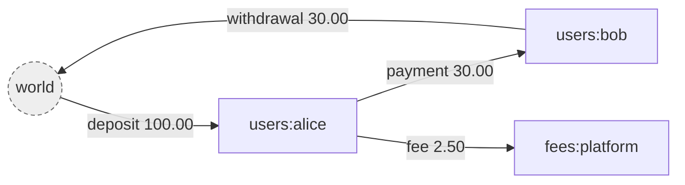
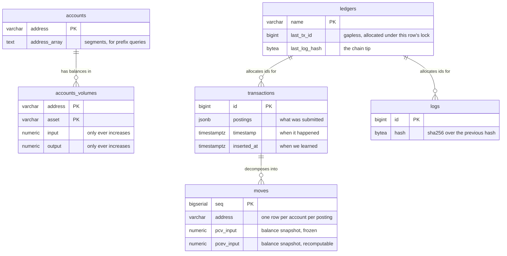
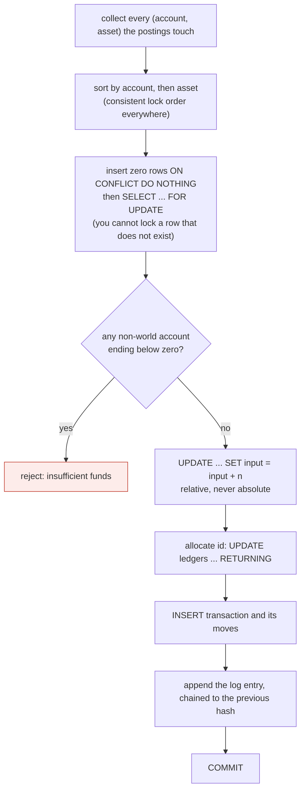

# giro

A double entry ledger. Go and PostgreSQL.

*giro*: a transfer between accounts, from the Greek for circle. Money moves
around the system and never leaves it, which is also the invariant the whole
design protects.

---

## What it is

A ledger records movements of value between accounts. Its only real job is to
never lose track of any of it.

The atomic unit is a **posting**: an amount of one asset moving from one account
to another.

```json
{ "source": "world", "destination": "users:alice", "asset": "USD/2", "amount": 10000 }
```

A **transaction** is an ordered list of postings applied atomically. All of them
commit or none do. That is the only write operation in the system.

Four ideas carry the rest.

**Money is conserved.** Value enters from a special account called `world` and
leaves to it. `world` is the only account allowed a negative balance. For any
asset, every balance summed together always equals exactly zero.



`world` is not a place money sits. It is the boundary of the ledger, standing
for everything not tracked here: a bank, a card network, someone's pocket. Its
balance is negative by exactly the total held inside, so reading it tells you
your outstanding liability.

**Volumes, not balances.** Each account holds two counters per asset, `input`
and `output`, and both only ever increase. Balance is `input - output`, computed
on read and stored nowhere. Keeping gross flow means an account that settled
millions and now holds nothing is distinguishable from one never used, and it
makes every update relative rather than absolute.

**The log is the source of truth.** Every change appends a SHA-256 chained entry
to `logs`. The `transactions` and `accounts_volumes` tables are a projection of
that log, kept because replaying from zero on every read would be absurd. If
they ever disagree with the log, the log is right.

**Nothing is mutated.** A mistake is corrected by appending a compensating
transaction, never by editing a row. Metadata is versioned. The history is the
product.

---

## Running it

Requires Go 1.26 and PostgreSQL 17.

```bash
createdb giro && createdb giro_test
cp .env.example .env          # then edit the connection strings
just migrate
just serve
```

Then open <http://localhost:8080/docs>, which renders the contract and can call
the running service.

`just` on its own lists every recipe. `just check` runs everything CI runs.

### The api

```
POST   /v1/ledgers/{ledger}                          create a ledger
GET    /v1/ledgers/{ledger}
POST   /v1/ledgers/{ledger}/transactions             commit, Idempotency-Key header, ?dryRun=true
POST   /v1/ledgers/{ledger}/transactions/bulk        commit several as one event
GET    /v1/ledgers/{ledger}/transactions             list, cursor paginated
GET    /v1/ledgers/{ledger}/transactions/{id}
POST   /v1/ledgers/{ledger}/transactions/{id}/revert
POST   /v1/ledgers/{ledger}/transactions/{id}/metadata
DELETE /v1/ledgers/{ledger}/transactions/{id}/metadata/{key}
GET    /v1/ledgers/{ledger}/accounts/{address}       ?expand=volumes,effectiveVolumes&at=
GET    /v1/ledgers/{ledger}/accounts/{address}/balances   ?at=
GET    /v1/ledgers/{ledger}/accounts/{address}/moves      statement, ?asset= &from= &to=
POST   /v1/ledgers/{ledger}/accounts/{address}/metadata
DELETE /v1/ledgers/{ledger}/accounts/{address}/metadata/{key}
GET    /v1/ledgers/{ledger}/accounts/{address}/balances
GET    /v1/ledgers/{ledger}/balances                 ?prefix=users:
GET    /v1/ledgers/{ledger}/logs                     the audit trail
```

`GET /v1/ledgers/{ledger}/balances` with no prefix covers the whole ledger,
`world` included, so it is always exactly zero for every asset. That is the
conservation invariant, readable over http.

`?at=` asks what was true on an effective date rather than what is true now.
The two differ whenever a transaction has been backdated, which for anything
taking settlement files from the outside world is most of the time.

---

## The data model

Six tables. Every one carries `ledger` as the first element of its key, so the
tenant boundary is structural rather than something each query has to remember.



`accounts_volumes` is the only table that is ever updated. Everything else is
append only.

The same facts live at three grains, and each answers a different question.

| Table | Grain | Answers |
|---|---|---|
| `transactions` | per transaction | what was submitted, verbatim |
| `moves` | per account per posting | what did this account do, and when |
| `accounts_volumes` | per account per asset | what is the balance now |

---

## How a transaction commits

One PostgreSQL transaction, in exactly this order. Steps 2 and 3 are the whole
trick.



Two properties fall out of the ordering.

Sorting removes the precondition for deadlock. Two sessions can only deadlock
by taking the same locks in opposite orders, so a globally consistent order
makes that impossible rather than merely unlikely.

Relative updates make a lost update impossible. The database performs the
addition, so a value read at the start never becomes a value written at the
end.

---

## Decision log

Each entry states what was decided and why. If something here looks arbitrary,
the reasoning is the point of the entry.

### D1. Postings name both sides, and amounts are always positive

A posting carries source, destination, asset and a positive amount. There is no
debit or credit flag and no sign.

Naming both sides in one record makes an unbalanced entry impossible to write
down, rather than an error to be detected later. Direction is already carried by
which field an account sits in, so a sign would be a second way of saying the
same thing, and two ways of saying one thing is two ways for them to disagree.

### D2. Volumes rather than balances

Store `input` and `output`, both monotonically increasing. Derive balance.

Three reasons, in increasing weight. Gross flow is information a balance
destroys. Additive updates compose under concurrency while absolute writes lose
each other. And a frozen snapshot on each move turns historical balance into an
index seek instead of a replay.

### D3. The asset string carries its own scale

`USD/2` means two decimal places, so `100` is one dollar. There is no scale
column anywhere.

A scale stored beside an amount can be lost in a serialisation round trip or
defaulted to zero by a migration, and then `10000` silently becomes ten thousand
dollars instead of a hundred. Fusing scale to identity makes an amount
uninterpretable without it.

### D4. Arbitrary precision integers everywhere

`*big.Int` in Go, `numeric` with no precision in PostgreSQL.

`int64` overflows at 9.2e18, which two units of an 18 decimal token reach. A
fixed width is a ceiling, and the cost of a ceiling here is silently wrong
money. A size guard of about 100 digits lives in validation to reject absurd
input, which is a denial of service concern rather than a business rule.

### D5. `timestamptz` for every timestamp

PostgreSQL stores an instant in UTC and converts on the way out.
`timestamp without time zone` stores wall clock with no zone, which puts the
burden of normalising on every write path, and one missed conversion is silent.

### D6. Gapless ids from a counter column, not a sequence

Transaction and log ids come from `UPDATE ledgers SET last_tx_id = last_tx_id + 1
RETURNING`, inside the transaction.

A sequence takes no row lock and is faster, but it is non transactional: a
rolled back transaction burns an id and leaves a gap. The counter serialises
writes per ledger, which we already pay for, because synchronous hash chaining
has to read the previous hash before writing the next. The lock needed for the
chain is the same lock that allocates the id, so gaplessness is free.

The cost is real: this lock is held until commit, so writes to a single ledger
are serialised. Writes to different ledgers are not, which is also how write
throughput scales.

### D7. No foreign key referencing `ledgers`

A foreign key check takes `FOR KEY SHARE` on the parent row. The commit path
takes `FOR UPDATE` on the same `ledgers` row to allocate an id. Two concurrent
transactions would each hold the shared lock and each wait to upgrade to the
exclusive one, which deadlocks. Sorting cannot help, because there is only one
lock and the problem is the change in strength rather than the order.

The `moves` to `transactions` foreign key is kept, because that parent row is
inserted by the same transaction and is invisible to anyone else, so there is
nothing to share and no upgrade.

### D8. `text[]` for exploded addresses, not `jsonb`

PostgreSQL arrays are ordered and indexable by position, which is exactly what
address matching needs: `address_array[1] = 'users'` for the first segment,
`array_length` for depth. Storing this as `jsonb` would mean encoding position
into the keys to get the same thing back.

### D9. Two address indexes, because there are two query shapes

A plain prefix such as `users:42:*` is a range scan on the address text using a
`varchar_pattern_ops` index. Measured on 150k accounts, that is an index only
scan costing 8 against 1297 for the GIN path.

A wildcard in the middle, `users:*:wallet`, cannot be expressed as a range, so
it uses GIN containment to narrow and a positional predicate to filter.
Containment alone is wrong because it is position independent: searching for
`users` also matches `fees:users:refunds`.

A positional predicate never drives an index. It is there for correctness, not
speed.

### D10. Forward only migrations, with checksums

No down migrations. You cannot un-drop a column that had data, so every real
rollback is a new migration anyway, and a down half is a file nobody tests that
lies under pressure.

Every applied migration records a SHA-256 of its body. Editing a migration that
already ran is a hard error, because otherwise development and production
diverge silently and only one of them is right.

### D11. Migrations hold a session advisory lock on a dedicated connection

Two instances booting at once must not both apply the same migration. A session
scoped advisory lock is released automatically when the connection drops, so a
crashed migration cannot strand it, which a lock row would.

It must be a dedicated `*pgx.Conn` and never a pool. Releasing on a different
pooled connection returns false and does nothing, leaving the lock held until
that connection happens to close. The signature takes `*pgx.Conn` so the type
system enforces this.

### D12. A nil amount panics instead of being read as zero

A nil counter in `Volumes` means nothing has flowed, so it is safely treated as
zero. A nil `Amount` on a posting means the request was malformed. Coercing it
would turn a broken payment into a no-op that commits and returns success.

Validation rejects nil, so the panic is unreachable through any correct path. It
exists to make a skipped validation loud rather than silent.


`jsonb` parses into a binary tree. It reorders keys, strips whitespace, and
silently keeps only the last of any duplicate key. The bytes that come back are
not the bytes that went in.

That is fatal for a hash chain. A hash taken at write time would never match one
recomputed during verification, so the integrity check would fail on a perfectly
healthy ledger, which is worse than not having one: a real problem becomes
indistinguishable from the false alarm.

`json` is validated on write and stored verbatim, and round trips byte for byte.
The indexing `jsonb` would buy is irrelevant here, because a log entry is
appended, read whole for replay, and looked up by `idempotency_key`, which is
its own column. Nothing ever queries inside one.

This applies only to `logs.data`. `transactions.postings` and the metadata
columns stay `jsonb`, since nothing hashes them and querying into them is
useful.

### D13. Multi ledger from the start, in one schema

Every table carries `ledger` first in its key. Retrofitting tenancy means
touching every table, index, query and test while carrying live data, whereas
adding the column now costs one column and gives the composite key that keyset
pagination wants anyway.

Since the hash chain serialises writes per ledger, separate ledgers are also how
write throughput scales.

### D14. The log entry is stored as `json`, not `jsonb`

`jsonb` parses into a binary tree. It reorders keys, strips whitespace, and
silently keeps only the last of any duplicate key. The bytes that come back are
not the bytes that went in.

That is fatal for a hash chain. A hash taken at write time would never match one
recomputed during verification, so the integrity check would fail on a perfectly
healthy ledger, which is worse than not having one: a real problem becomes
indistinguishable from the false alarm.

`json` is validated on write and stored verbatim, and round trips byte for byte.
The indexing `jsonb` would buy is irrelevant here, because a log entry is
appended, read whole for replay, and looked up by `idempotency_key`, which is
its own column. Nothing ever queries inside one.

This applies only to `logs.data`. `transactions.postings` and the metadata
columns stay `jsonb`, since nothing hashes them and querying into them is
useful.

---

### D15. The contract is written first, and only models are generated

`api/openapi.yaml` is the source of truth for the http surface, and the Go
types in `internal/api/gen.go` are generated from it. Changing the request shape
therefore shows up as a diff in the contract, deliberately made, rather than
falling out of somebody editing a struct.

Only models are generated. The same tool will also emit routing and query
parameter binding, but that pulls three modules into the build to parse query
strings, for a surface of eight endpoints on the standard library router. So
routing is hand written, and what the compiler no longer checks a test does:
every path in the contract must have a route, and every route must be in the
contract.

The generator itself is not a dependency. It runs from `just generate` with a
pinned version, so it never enters `go.mod`. The only thing this service links
against is a postgres driver.

### D16. Amounts are json numbers, and the Go type is a pointer

An amount goes over the wire as a json number rather than a string, matching how
it is stored: an arbitrary precision integer in the asset's smallest unit.

That has one consequence worth stating loudly, because it is a client side
hazard rather than a server one. Amounts can exceed 2^53, and JavaScript's
`JSON.parse` silently loses precision above that. A browser client must use a
big number aware parser. The contract says so in its description.

On the Go side the generated type is `*big.Int` and not `big.Int`, which is not
a stylistic preference. `big.Int` implements `MarshalJSON` on the pointer
receiver, and `encoding/json` can take the address of a struct field inside a
slice but not of a map value. With a value type, amounts inside slices marshal
correctly and every amount inside a map silently marshals as `{}`. Balances are
maps.

### D17. Errors carry a stable code, and 422 is not 400

Every error response has a `code` from a fixed set, alongside the http status.
The message is for humans and may change, the code is what a client branches on.

400 and 422 are different answers. A 400 means the request was malformed: a
negative amount, an address with a trailing space, a lowercase asset. A 422
means the request was well formed and could not be applied, which in practice
means insufficient funds. A client can fix the first by changing its code and
the second only by changing the world, so they should not share a status.

Insufficient funds carries the numbers in `details`, because an error a client
can act on programmatically should not require parsing a sentence.

Internal errors return a generic message. The real one goes to the log, since it
can carry table names, queries and account addresses.

### D18. Timestamps are truncated to microseconds

Postgres stores `timestamptz` at microsecond precision. A timestamp with
nanoseconds would be silently rounded on the way in, so the response to a create
would disagree with every later read of the same transaction.

Truncating at the boundary means the value returned is the value stored.

### D19. Malformed query strings are rejected rather than ignored

Go's `r.URL.Query()` discards any parameter it cannot parse, so a corrupted
query string arrives at a handler as absent parameters. For a cursor that is
dangerous: the client would silently receive the first page again and reprocess
transactions it has already seen.

Query strings are parsed explicitly, and anything unparseable is a 400.

### D20. Expansions are opt in, and an unknown one is an error

`GET /accounts/{address}` returns the account without its volumes, because most
reads of an account want its metadata rather than its money, and volumes cost a
second query. `?expand=volumes` asks for them.

An unrecognised expand value is a 400 rather than being ignored, so a typo does
not look like an account that happens to have no volumes.


### D21. Metadata history lives in the log, not in a revision table

Metadata is stored on the `transactions` and `accounts` rows as a jsonb column,
and every change appends a `SET_METADATA` or `DELETE_METADATA` entry to the log.

The obvious alternative is a table keyed by `(target, revision)` holding every
version of the document. That answers "what was the metadata at revision 3",
which nothing has asked for, and it would be a second append only history of
the same events with weaker guarantees than the one that is hash chained.

The split instead is: the column says what it is now, the log says how it got
that way, and a historical value is a replay of the log up to a date. If an
indexed historical lookup is ever needed, it can be built from the log, which
is what having a source of truth is for.

Postgres does the merge and the delete natively, `metadata || $new` and
`metadata - $key`, so there is no read modify write and two callers touching
different keys do not overwrite each other.

### D22. A metadata write that changes nothing writes nothing

Setting metadata that is already present is a no-op: no row is touched and no
log entry is appended.

Clients retry, so an identical write is normal traffic rather than a mistake.
Recording it would fill the hash chain with entries describing nothing
happening.

The cost is that the trail records changes rather than attempts, so "someone
tried to set this at 14:03" is not answerable when the value was already set.
For a ledger, what changed is the more useful record.

### D23. Tagging an account creates it

Accounts are never registered, so setting metadata on an address that has never
been used creates the row rather than returning a 404.

That is the moment a caller most wants it: attaching a user id to a wallet
before any money has moved through it. The account still holds nothing, since
tagging is not funding.


### D24. A revert is a new transaction, and it can fail

Reverting does not edit or delete anything. It commits a new transaction
holding the original's postings with both sides swapped, and stamps
`revertedAt` on the original as a mark that a correction exists.

Balances return to where they were. Volumes do not: both counters go up, so the
rows record that money moved and then came back, rather than looking like it
never moved.

The reversal goes through the same locking, balance check and log append as any
other transaction, which means it can be **rejected**. If the money has since
been spent it is not there to give back, and forcing it would manufacture a
negative balance. `force` exists for an operator who has decided that is the
lesser problem, and it is a deliberate act rather than a default.

Two guards worth knowing about. `revertedAt` is set inside the same database
transaction as the reversal, so two concurrent reverts cannot both pass the
check and refund twice. And the reversal reverses the *order* of the postings as
well as their direction, because keeping the order would pay the first account
back before the last had returned anything, and an intermediate account would
dip below zero.

### D25. A reversal is dated now, unless asked otherwise

By default the reversal carries the current time, not the original's effective
date. A reversal happens when it happens, and backdating one rewrites what
historical balances say about a period that has probably already been reported
on.

`atEffectiveDate` asks for the other behaviour, for the case where the reversal
is correcting a data entry error rather than undoing a real movement.


### D26. Effective volumes are maintained on write and verified by replay

Every move carries two snapshots. `pcv` follows insertion order and is written
once, recording what the ledger believed at the time. `pcev` follows effective
date order, which is a different sequence whenever a transaction is backdated,
and answers what was actually true on a date.

`pcev` is maintained on write: a new move reads the effective balance as of its
own timestamp, accumulates from there, and shifts every move already sitting
later in effective order by its delta. Historical balance is then an index seek
rather than a sum over an account's whole history.

The alternative is computing it on read, which is trivially correct and grows
with the account's age. Maintaining a cache is faster and can be wrong, so the
slow version exists too, as `VerifyEffectiveVolumes`: it walks every account in
effective order, accumulates, and compares against what is stored. Randomised
sequences of backdated transactions are checked against it.

That is the trade. The optimisation is only defensible because something
independent checks it, and an optimisation nothing checks is a guess.

The fix up is written in Go rather than as a database trigger, for the same
reason: logic in PL/pgSQL is hard to test and invisible to the type system.

### D27. The log is verified against the projection, not just for tamper evidence

`VerifyProjection` replays the log and requires that `accounts_volumes` is
exactly what it produces, that every transaction was logged, and that the log
describes no transaction the table lacks.

This is what makes "the log is the source of truth" a fact rather than a
statement of intent. It is also the only check that would catch a commit path
writing one thing and logging another: every other assertion reads the
projection, so a consistent lie passes all of them. Reversing the postings in
the logged copy leaves conservation, every balance and the hash chain intact,
and only this notices.

### D28. Dry run is the real path, rolled back

`?dryRun=true` takes the locks, checks the balances against live data, writes
the volumes and moves, and then rolls back instead of committing.

It is not a simulation, so it cannot drift from what a commit does. A
transaction that would be rejected is rejected here with the same status, which
is the entire point of previewing.

Nothing is consumed: no id is allocated, no idempotency key is claimed, no log
entry survives, and the account rows materialised to take locks disappear with
everything else. The id on the response is what it would have been, not a
reservation. It answers 200 rather than 201, because nothing was created.


### D29. Batches are atomic, and only atomic

`POST /transactions/bulk` applies every transaction or none of them. There is no
best effort mode and no per item result list.

A best effort batch is several requests with fewer round trips, which a caller
can do in a loop. All or nothing is the thing that cannot be built out of single
commits, so it is the one worth offering. Items are applied in order and see
each other's effects, so an item may spend what an earlier item provided.

Every lock the batch needs is taken up front, deduplicated and sorted, before
any item runs. Sorting within an item is not enough here: two batches touching
the same accounts in different item orders would each hold half of what the
other needs. Measured, a batch of fifty is roughly twice the throughput of fifty
single commits, because it pays for the ledger row lock once.

At most 100 items, because an unbounded batch holds locks on an unbounded number
of rows on tables other requests are queueing for.

### D30. Writes to one ledger are serialised, and that is measured

Every commit takes an exclusive lock on its ledger's row to allocate ids and
read the chain tip, and holds it until commit. So writes to a single ledger do
not benefit from more callers.

Measured on a laptop against local postgres:

| | |
|---|---|
| one caller, one ledger | about 1,200 transactions per second |
| sixteen callers, one ledger | about 1,200 per second, and zero retries |
| sixteen callers, eight ledgers | about 3,100 per second |
| batch of fifty against fifty singles | roughly twice the throughput |

The flat line from one caller to sixteen is the design working as described,
not a bottleneck to be tuned away. Throughput scales by adding ledgers, which
is one reason multiple ledgers exist. Zero retries under contention means the
lock ordering is holding: transactions queue rather than deadlock.

### D31. The write path reads a snapshot rather than summing history

Computing what an account held as of a date is the same question on the read
path and the write path: a read answers it for a caller, and a commit needs it
to place a new move in effective order.

The read path always read the latest snapshot. The write path summed the whole
history, which is O(n) in the account's age on every write. On 20,000 moves that
is a sequential scan taking 2 ms against an index seek taking 0.03 ms, roughly
sixty times slower and growing.

Both now read the snapshot. This was found by benchmarking, not by any
correctness test: the results were identical either way.


## Layout

```
api/openapi.yaml     the contract. written first, types generated from it
cmd/giro/            cli: serve, migrate
internal/ledger/     domain: postings, volumes, addresses, assets. no sql
internal/storage/    the commit path, the log chain, queries. no http
internal/api/        handlers, error mapping, the docs page
internal/migrate/    migration runner and generator
migrations/          numbered sql, embedded into the binary
```

Inside `internal/storage`, one file per concern rather than one large one:

```
store.go       the type, scoped to a ledger
commit.go      the retry loop and the sequence inside one database transaction
allocate.go    id allocation and log appending, under one row lock
rows.go        the individual inserts a commit performs
moves.go       moves, and maintaining the two volume histories
retry.go       which errors are worth retrying, and for how long
volumes.go     locking and applying volume deltas
revert.go      compensating transactions
metadata.go    merge and delete, with the no-op guard
read.go        queries and keyset pagination
effective.go   reads by effective date
verify.go      the invariant checks
```

Each layer knows nothing about the one above it. The domain has no sql, storage
has no http, and the generated types in `internal/api/gen.go` come from the
contract rather than from the domain, so the wire format can change without
disturbing the engine.
