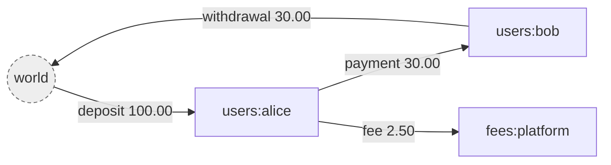
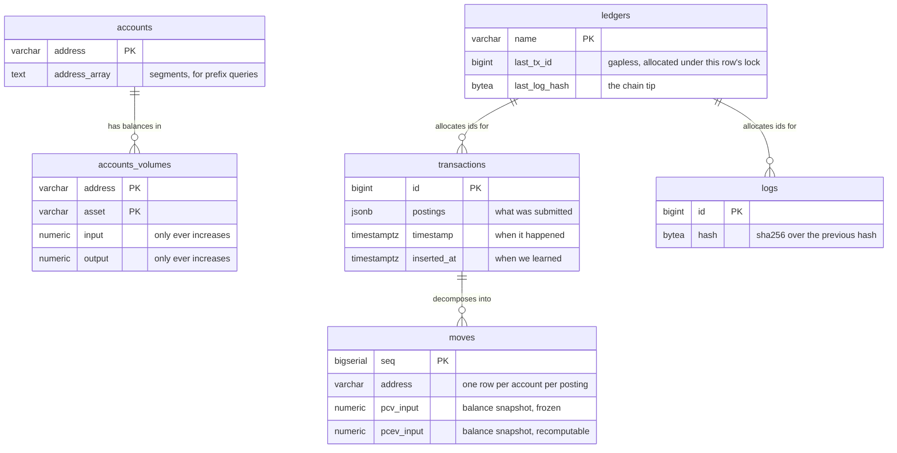
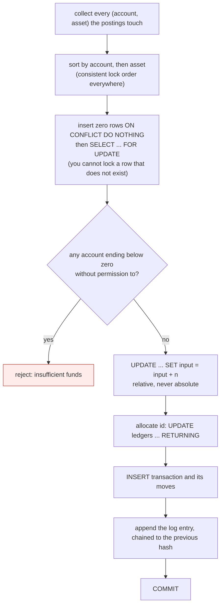

# giro

A double entry ledger. Go and PostgreSQL.

*giro*: a transfer between accounts, from the Greek for circle. Money moves
around the system and never leaves it, which is also the invariant the whole
design protects.

```go
tx, err := store.CommitTransaction(ctx, ledger.Postings{
    {Source: "world", Destination: "users:alice", Asset: "USD/2", Amount: big.NewInt(10000)},
}, storage.CommitOptions{Reference: "deposit-1"})
```

- **Money cannot be created or destroyed**, and the database enforces it, not
  just the application.
- **History cannot be rewritten.** Append only, hash chained, and it holds
  against raw SQL.
- **Arbitrary precision.** `*big.Int` and `numeric`, so an 18 decimal token is
  not a rounding problem.
- **Two clocks.** What was true on the 3rd stays answerable after a settlement
  file arrives on the 7th.
- **Nine checks** you can schedule, each of which reports what it examined.

One direct dependency: the Postgres driver.

---

## Quickstart

Five minutes to a working ledger. Requires Go 1.26 and PostgreSQL 17.

### 1. Create the database and run the migrations

```bash
createdb giro && createdb giro_test
cp .env.example .env          # then edit the connection strings

just migrate                  # apply the schema
just db-app-role              # create the role the service connects as
```

`.env` carries two connection strings on purpose. Migrations need the role that
owns the tables; serving must not have it, because a table's owner can switch
off the triggers that guard it.

### 2. Start it

```bash
just serve
```

Open <http://localhost:8080>. That page explains the model and drives the
running service: create a ledger, commit transactions, watch the balances and
the hash chain, and see a real rejection.

`giro serve` refuses to start against a schema it does not match, and warns if
it is connected as something that can disable its own guards.

### 3. Make a ledger and put money in it

Every ledger declares the assets it handles. `USD/2` carries its own scale, so
`10000` is $100.00.

```bash
L=http://localhost:8080/v1/ledgers/demo

curl -X POST $L
curl -X POST $L/assets -H 'Content-Type: application/json' -d '{"asset":"USD/2"}'

curl -X POST $L/transactions -H 'Content-Type: application/json' -d '{
  "postings": [
    {"source": "world", "destination": "users:alice", "asset": "USD/2", "amount": 10000}
  ]
}'
```

`world` is where value enters from. It is the only account allowed a negative
balance by default, and its balance is your total outstanding liability.

### 4. Read it back

```bash
curl $L/accounts/users:alice/balances   # {"USD/2":10000}
curl $L/balances                        # {"USD/2":0}  <- conservation
curl $L/logs                            # the hash chained audit trail
```

That second one is the point. Summed across every account, every asset is
exactly zero — always, by construction.

### 5. Try to break it

```bash
curl -X POST $L/transactions -H 'Content-Type: application/json' -d '{
  "postings": [
    {"source": "users:alice", "destination": "users:bob", "asset": "USD/2", "amount": 999999}
  ]
}'
# 422  {"code":"INSUFFICIENT_FUNDS","message":"users:alice holds 10000 USD/2, needs 999999"}
```

### 6. Check the book

```bash
just verify
```

Nine checks, each reporting what it examined. `giro verify --last --max-age=25h`
is the other half: it fails if a check has *stopped* running.

`just` on its own lists every recipe. `just check` runs `fmt`, `vet`, `lint`,
`test` and `test-restricted` — everything CI runs, including the whole suite as
the restricted database role.

### The commands

```
giro serve [addr]              run the http api, default :8080
giro migrate up                apply every pending migration
giro migrate status            what has run and what has not
giro migrate new <name>        create an empty migration
giro verify [ledger...]        run every check, record that they ran
giro verify --last             when each check last ran
```

`giro migrate` reads `GIRO_MIGRATE_DATABASE_URL` in preference to
`DATABASE_URL`, so the owner's credential stays out of the serving environment.

---

## Using it as a library

giro is importable, not only a server. `internal/api` is the server and stays
private; everything else is public.

```go
import (
    "github.com/pixperk/giro/ledger"   // postings, volumes, addresses, assets
    "github.com/pixperk/giro/storage"  // the engine
    "github.com/pixperk/giro/migrate"  // the migration runner
    "github.com/pixperk/giro/fx"       // conversion at a stated rate
    "github.com/pixperk/giro/recon"    // matching statement lines
)

store := storage.New(pool, "main")
```

`ledger` and `storage` know nothing about currencies, trades, wires or rails.
`fx` and `recon` are layers above that do, and the compiler enforces that
direction: the engine cannot import them.

| Package | For |
|---|---|
| [`recon`](recon/README.md) | Reconciling against banks, exchanges and chains — [API](recon/API.md) |
| `fx` | Deriving a conversion's amounts from its rate |
| `migrate` | Applying and checking migrations |

---
## What it is

A ledger records movements of value between accounts. Its only real job is to
never lose track of any of it.

The atomic unit is a **posting**: an amount of one asset moving from one account
to another.

```json
{ "source": "world", "destination": "users:alice", "asset": "USD/2", "amount": 10000 }
```

A **transaction** is an ordered list of postings applied atomically. All of them
commit or none do. That is the only write operation in the system.

Four ideas carry the rest.

**Money is conserved.** Value enters from a special account called `world` and
leaves to it. `world` is allowed a negative balance, and by default it is the
only one. For any asset, every balance summed together always equals exactly
zero.



`world` is not a place money sits. It is the boundary of the ledger, standing
for everything not tracked here: a bank, a card network, someone's pocket. Its
balance is negative by exactly the total held inside, so reading it tells you
your outstanding liability.

**Volumes, not balances.** Each account holds two counters per asset, `input`
and `output`, and both only ever increase. Balance is `input - output`, computed
on read and stored nowhere. Keeping gross flow means an account that settled
millions and now holds nothing is distinguishable from one never used, and it
makes every update relative rather than absolute.

**The log is the source of truth.** Every change appends a SHA-256 chained entry
to `logs`. The `transactions` and `accounts_volumes` tables are a projection of
that log, kept because replaying from zero on every read would be absurd. If
they ever disagree with the log, the log is right.

**Nothing is mutated.** A mistake is corrected by appending a compensating
transaction, never by editing a row. Metadata is versioned. The history is the
product.

---
---

### The api

```
POST   /v1/ledgers/{ledger}                          create a ledger
GET    /v1/ledgers/{ledger}
POST   /v1/ledgers/{ledger}/assets                   register an asset, required before use
GET    /v1/ledgers/{ledger}/assets
POST   /v1/ledgers/{ledger}/transactions             commit, Idempotency-Key header, ?dryRun=true
POST   /v1/ledgers/{ledger}/transactions/bulk        commit several as one event
GET    /v1/ledgers/{ledger}/transactions             list, cursor paginated
GET    /v1/ledgers/{ledger}/transactions/{id}
POST   /v1/ledgers/{ledger}/transactions/{id}/revert
POST   /v1/ledgers/{ledger}/transactions/{id}/metadata
DELETE /v1/ledgers/{ledger}/transactions/{id}/metadata/{key}
GET    /v1/ledgers/{ledger}/accounts/{address}       ?expand=volumes,effectiveVolumes&at=
GET    /v1/ledgers/{ledger}/accounts/{address}/balances   ?at=
GET    /v1/ledgers/{ledger}/accounts/{address}/moves      statement, ?asset= &from= &to=
POST   /v1/ledgers/{ledger}/accounts/{address}/metadata
DELETE /v1/ledgers/{ledger}/accounts/{address}/metadata/{key}
GET    /v1/ledgers/{ledger}/accounts/{address}/balances
GET    /v1/ledgers/{ledger}/balances                 ?prefix=users:
GET    /v1/ledgers/{ledger}/logs                     the audit trail
```

Outside the versioned API:

```
GET    /                 the page that explains the model and drives the service
GET    /docs             the contract, rendered and callable
GET    /openapi.yaml     the contract itself
GET    /healthz          liveness
```

`GET /v1/ledgers/{ledger}/balances` with no prefix covers the whole ledger,
`world` included, so it is always exactly zero for every asset. That is the
conservation invariant, readable over http.

`?at=` asks what was true on an effective date rather than what is true now.
The two differ whenever a transaction has been backdated, which for anything
taking settlement files from the outside world is most of the time.

---
---

## The data model

Six tables. Every one carries `ledger` as the first element of its key, so the
tenant boundary is structural rather than something each query has to remember.



Only `logs` is append only without qualification. `accounts_volumes` is updated
by every commit, and three others change in narrow, named ways: a transaction
is stamped when reverted and carries metadata, a move has its effective volumes
rewritten when something lands behind it, and an account's metadata and first
usage move. Nothing that was *recorded* ever changes, and the database enforces
exactly that column by column (D35).

The same facts live at three grains, and each answers a different question.

| Table | Grain | Answers |
|---|---|---|
| `transactions` | per transaction | what was submitted, verbatim |
| `moves` | per account per posting | what did this account do, and when |
| `accounts_volumes` | per account per asset | what is the balance now |

---
---

## How a transaction commits

One PostgreSQL transaction, in exactly this order. Steps 2 and 3 are the whole
trick.



Two properties fall out of the ordering.

Sorting removes the precondition for deadlock. Two sessions can only deadlock
by taking the same locks in opposite orders, so a globally consistent order
makes that impossible rather than merely unlikely.

Relative updates make a lost update impossible. The database performs the
addition, so a value read at the start never becomes a value written at the
end.

---
---

## The checks

Nine, none on the write path. `giro verify` runs them all and exits non-zero on
a finding.

| Check | Catches | A finding means |
|---|---|---|
| `conservation` | Value created or destroyed | **A fault.** The master invariant. |
| `log` | An entry edited or removed | **A fault.** The chain is broken. |
| `projection` | The tables disagreeing with the log | **A fault.** The only check that sees a commit path writing one thing and logging another. |
| `effective_volumes` | The backdating cache disagreeing with a replay | A fault. |
| `balance_permissions` | A balance outside a bound it may not cross | A fault, or a deliberate revocation. |
| `closed_accounts` | A closed account holding money | Somebody must reopen it and deal with it. |
| `stale_balances` | Money that has stopped moving | A question. Opt in with `--stale-after`. |
| `conversions` | Amounts disagreeing with the rate recorded beside them | A fault. From `fx`. |
| `reconciliation` | Statement lines still unmatched | The daily work queue. Opt in with `--recon-after`. From `recon`. |

The last two are contributed by layers above the engine rather than built into
it: the ledger has no idea two postings are a trade, or that a statement line
describes one of its movements.

`projection` is the one to run if you can only run one. It replays the log and
requires the tables to be exactly what the replay produces, which is what makes
"the log is the source of truth" a fact rather than an intention — and every
other check reads the projection, so a consistent lie passes them all.

---

## Operating it

| | |
|---|---|
| [deploy/](deploy/) | Scheduling the checks: cron, systemd, Kubernetes, and what to page on |
| `giro verify` | Nine checks. Exits non-zero on a finding. |
| `giro verify --last --max-age=25h` | Fails if a check has stopped running |
| `just privileges` | What the serving connection can actually do |
| `just db-sweep` | Drop test schemas an interrupted run left behind |
| `just replay SEED` | Reproduce a property test failure from its printed seed |

**Alert on two conditions, not one.** Findings above zero, *and* the absence of
a recent run. A detector that stopped running looks exactly like a book with
nothing wrong.

---

## Layout

```
api/openapi.yaml     the contract. written first, types generated from it
cmd/giro/            cli: serve, migrate
ledger/              domain: postings, volumes, addresses, assets. no sql
storage/             the commit path, the log chain, queries. no http
migrate/             migration runner and generator
internal/api/        handlers, error mapping, the docs page
migrations/          numbered sql, embedded into the binary
```

`ledger`, `storage` and `migrate` are importable. `internal/api` is not: it is
the server, not the library, and its shape is the contract in
`api/openapi.yaml` rather than a Go surface anyone should depend on.

Inside `storage`, one file per concern rather than one large one:

```
store.go       the type, scoped to a ledger
commit.go      the retry loop and the sequence inside one database transaction
allocate.go    id allocation and log appending, under one row lock
rows.go        the individual inserts a commit performs
moves.go       moves, and maintaining the two volume histories
retry.go       which errors are worth retrying, and for how long
volumes.go     locking and applying volume deltas
policy.go      which accounts may end below zero
revert.go      compensating transactions
metadata.go    merge and delete, with the no-op guard
read.go        queries and keyset pagination
effective.go   reads by effective date
verify.go      the invariant checks
```

Each layer knows nothing about the one above it. The domain has no sql, storage
has no http, and the generated types in `internal/api/gen.go` come from the
contract rather than from the domain, so the wire format can change without
disturbing the engine.

---

## Why it is like this

[DECISIONS.md](DECISIONS.md) records every non-obvious choice, the reasoning,
and what was turned down. Read it before changing something that looks wrong:
most of the constraints are load-bearing, and several were arrived at by being
wrong first.
